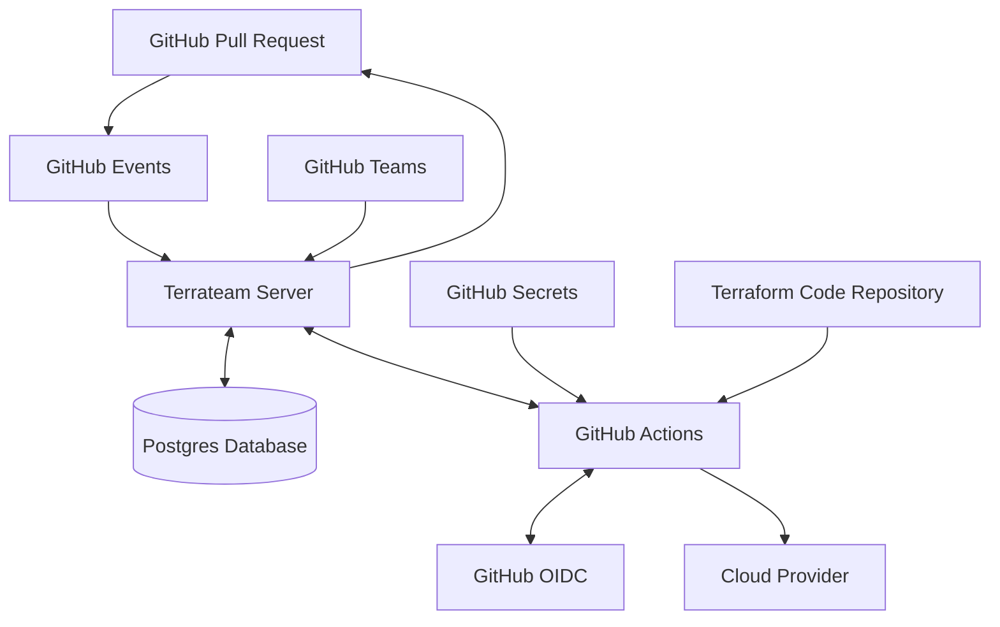

<picture width="400px" align="center">
  <source media="(prefers-color-scheme: dark)" srcset="https://raw.githubusercontent.com/terrateamio/brand-artifacts/a3a6f1818c60b3f14a982e30f93aa4dd9ca3e08e/terrateam-full-logo-white-text.svg">
  
</picture>

[](https://github.com/terrateamio/terrateam/stargazers)
[](https://terrateam.io/slack)
[](https://github.com/terrateamio/mono/releases)
[](https://ocaml.org)
[](https://opensource.org/licenses/MPL-2.0)

## Terrateam
[Terrateam](https://terrateam.io) is an open-source GitOps CI/CD platform for automating infrastructure workflows. It integrates with GitHub to orchestrate Terraform, OpenTofu, CDKTF, and Terragrunt operations via pull requests. Use our hosted service or run on-premise.

### Why Terrateam
#### **True GitOps**
Every part of your Terrateam configuration lives directly in Git, right alongside your code. Branch, merge, and revert configurations exactly like code, with no external setup or separate configuration files. This ensures full version control, traceability, and seamless integration with your existing Git workflows.

#### Built for Scale and Reliability
- **GitHub-Native**: Manage Terraform workflows in GitHub with Actions, PRs, and Secrets, no extra tools.
- **Enterprise-Grade Security**: RBAC, SSO, and audit trails for secure, compliant infrastructure.
- **High Availability**: Handles parallel execution, multi-repo environments with distributed architecture.
- **Drift Detection**: Alerts teams when live infrastructure diverges from infrastructure as code.
- **Multi-Environment Support**: Easily manage dev, staging, and production environments.

Terrateam combines powerful GitOps automation with enterprise-ready security and scalability, all directly in GitHub.

---

## Getting Started
### Terrateam SaaS
Get started quickly with our free SaaS version by signing up at [https://terrateam.io](https://terrateam.io).

### Self-Hosted Deployment
For those who prefer more control, you can deploy Terrateam in your own environment.

#### Local Setup with Docker Compose
##### Prerequisites
Before you begin, ensure you have the following:

- Docker and Docker Compose installed on your machine.
- A way to expose the Terrateam server to the internet. The server must be able to receive GitHub webhooks and allow the GitHub Action to communicate with it.
  - **For local testing:** Terrateam supports [Ngrok](https://ngrok.com/) natively through the provided `docker-compose.yml` file. Alternatively, you can use [any tunneling](https://github.com/anderspitman/awesome-tunneling) or reverse proxy tool that fits your needs.
  - **For production environments:** It is recommended to use a load balancer or another production-grade solution for secure and reliable communication. [Read the docs](https://docs.terrateam.io/self-hosted/overview/) for more details.

#### Terrateam Setup Steps

1. **Clone the `terrateamio/terrateam` repository:**
   ```sh
   git clone https://github.com/terrateamio/terrateam.git
   cd terrateam/docker/terrat
   ```

2. **Start the Terrateam setup container:**
   ```sh
   GH_ORG=YOUR_GITHUB_ORG docker-compose up setup
   ```

3. **Navigate to [http://localhost:3000](http://localhost:3000)** to create your private Terrateam GitHub application. Take note of your application URL for use below.

   > ⚠️ **Important:** Do not install your private Terrateam GitHub application until you complete the steps below.

4. **Save the generated GitHub application settings**
   Create a `.env` file in the `terrateam/docker/terrat` directory, next to the `docker-compose.yml` file, and save the settings there.

5. **Stop the Terrateam setup container** by pressing `Ctrl+C` in the terminal to stop the container.

6. **Start the Terrateam Server:**
   [Get your Ngrok auth token here](https://dashboard.ngrok.com/get-started/your-authtoken)
   ```sh
   NGROK_AUTHTOKEN=<YOUR-NGROK-AUTH-TOKEN> docker-compose up server -d
   ```
   
7. **Wait for the server to be ready.** The `docker-compose` command will return you to your shell when the Terrateam Server is ready for connections.

8. **Install your private Terrateam GitHub application** using the application URL from step 3. You can install Terrateam against your entire organization or specific repositories.

   > ⚠️ **Important:** Ensure the Terrateam Server is running (see step 7) before installing the GitHub application.

9. **Add the Terrateam GitHub Actions Workflow**
   Download [terrateam.yml](https://raw.githubusercontent.com/terrateamio/terrateam-example/main/github/actions/workflows/default/terrateam.yml) and
   save it in your repository under `.github/workflows/terrateam.yml`. The Terrateam GitHub Actions workflow file must reside in the default branch of your Terraform repository, typically named `main` or `master`.

10. **Start Using Terrateam**
    Create a pull request with a Terraform code change to automatically trigger a Terraform `Plan` operation. For detailed instructions on your first Terrateam deployment, refer to the [Quickstart Guide](https://docs.terrateam.io/quickstart-guide#your-first-terrateam-deployment).

For non-local setup instructions, including manual setup and Kubernetes deployment options, follow our [Self-Hosted Guide](https://docs.terrateam.io/self-hosted/overview) to get up and running.

---

## Features
- **GitOps Integration**: Orchestrate Terraform changes using GitHub pull requests and Actions.
- **High Availability**: Scale seamlessly across teams and large workloads with distributed architecture.
- **Apply Before/After Merge**: Apply infrastructure changes either before or after merging.
- **Cost Estimation**: Predict infrastructure costs automatically before applying changes.
- **OIDC Authentication**: Authenticate cloud providers securely using OpenID Connect.
- **Apply Locks**: Avoid conflicts with automatic locking and concurrent operations.
- **Parallel Runs**: Run multiple operations in parallel with no concurrency limits.
- **Private Runners**: Execute workflows securely in your own environment using dedicated runners.
- **Apply Requirements**: Ensure compliance and approval checks before applying any changes.
- **Drift Detection**: Detect and reconcile infrastructure drift from Terraform or OpenTofu configurations.
- **Layered Runs**: Establish dependencies between operations to ensure proper execution order.
- **Multiple Environments**: Manage multiple environments using GitHub Environments.
- **GitHub Secrets**: Safely store and manage sensitive data like credentials in your workflows.
- **Configuration Builder**: Dynamically generate configurations for complex workflows.
- **Role-Based Access Control (RBAC)**: Securely manage permissions across GitHub identities.
- **Audit Trail**: Track and review all infrastructure changes for compliance and security.

---

### Architecture Overview
Terrateam’s architecture is built for high availability and reliability.

- **Terrateam Server**: Orchestrates infrastructure, scalable for complex environments and parallel operations.
- **GitHub Application**: Enables GitOps workflows with native GitHub functionality.
- **GitHub Actions**: Powers infrastructure as code executions.
- **Postgres Database**: Securely stores operations data and configurations for consistency and auditability.



For more details, see our [How It Works Documentation](https://docs.terrateam.io/how-it-works).

## Configuration
Terrateam’s configuration is managed in an in-repo `.terrateam/config.yml` file, providing flexibility for custom workflows and advanced settings. You can also dynamically generate configurations using the `config_builder` for even more control.

For more details and example configurations, explore the [Configuration Reference](https://docs.terrateam.io/configuration-reference/) and [Advanced Workflows](https://docs.terrateam.io/advanced-workflows/) sections of our documentation to customize Terrateam to your specific use cases.

## Resources
- [Website](https://terrateam.io/)  
- [Documentation](https://docs.terrateam.io/)
- [GitHub Discussions](https://github.com/terrateamio/terrateam/discussions)
- [Join our Slack](https://terrateam.io/slack)
- [Terrateam Blog](https://terrateam.io/blog)
- If you have any questions, you can email us at [support@terrateam.io](mailto:support@terrateam.io)

---

## Contributing
Thank you for your interest in contributing to Terrateam! We appreciate your help in improving the project. Whether you're fixing bugs, suggesting new features, or improving documentation, your contributions are essential to making Terrateam better for everyone.

> 🌟 **If you find Terrateam useful, starring the repo is always appreciated!**
> Your support helps increase the project’s visibility, allowing us to grow and continue improving Terrateam for the community.

### Ways to Contribute
- **Reporting Issues**: If you encounter bugs or other issues, please report them via [GitHub Issues](https://github.com/terrateamio/terrateam/issues). Make sure to include as much detail as possible (e.g., steps to reproduce, environment, logs).
- **Improving Documentation**: We welcome updates that enhance clarity or add useful information. Your contributions make Terrateam easier to use for the whole community.
- **Bug Fixes & New Features**: If you're interested in submitting code changes, we encourage you to review our [Contributing Guide](CONTRIBUTING.md) to understand the process. Since the codebase follows specific styles, contributions may need adjustments to fit project standards.
- **Feature Requests**: Have an idea to enhance Terrateam? We welcome your feature suggestions! Please open an issue on [GitHub Issues](https://github.com/terrateamio/terrateam/issues) and describe the problem you're solving and how your feature would help. We can't guarantee all requests will be implemented, but we'll review them carefully. Thumbs up your favorite feature requests.

Please refer to the [Contributing Guide](CONTRIBUTING.md) for detailed steps on how to contribute and what to expect during the review process.

### Community Support
If you'd like to engage with the community or need help, you're welcome to participate in [GitHub Discussions](https://github.com/terrateamio/terrateam/discussions) or join our [Slack Community](https://terrateam.io/slack). We'd love to hear your feedback, ideas, and questions.

Thank you for being a part of the Terrateam community and helping us make it better!

## Open-Source vs. Paid
Terrateam is available in two versions:

- **Community Edition (CE)**: Open-source, offering powerful infrastructure automation features. Perfect for small teams and individual developers looking for seamless GitOps workflows and infrastructure automation. [Learn more about Self-Hosted CE](https://docs.terrateam.io/self-hosted/overview).
  
- **Enterprise Edition (EE)**: Designed for larger teams and organizations that require advanced features like RBAC, UI-based audit trails, centralized configuration, and more. Available via [Terrateam Cloud](https://terrateam.io) (all plans), Private Cloud, or Self-Hosted options. The Enterprise Edition is ideal for companies with stricter compliance and governance requirements. [Contact us](https://terrateam.io/contact) for more details.

| Category                    | Feature                             | Open-Source (MPL-2.0)    | Enterprise (Proprietary) |
|-----------------------------|-------------------------------------|--------------------------|--------------------------|
| **Core Features**           | Plan & Apply Operations             | :white_check_mark:       | :white_check_mark:       |
|                             | Apply Before / After Merge          | :white_check_mark:       | :white_check_mark:       |
|                             | Layered Runs (Dependencies)         | :white_check_mark:       | :white_check_mark:       |
|                             | Drift Detection & Reconciliation    | :white_check_mark:       | :white_check_mark:       |
|                             | Cost Estimation                     | :white_check_mark:       | :white_check_mark:       |
| **Scalability**             | High Availability                   | :white_check_mark:       | :white_check_mark:       |
|                             | Unlimited Concurrency               | :white_check_mark:       | :white_check_mark:       |
|                             | Private Runners                     | :white_check_mark:       | :white_check_mark:       |
| **Integrations**            | GitHub Environments Support         | :white_check_mark:       | :white_check_mark:       |
|                             | GitHub Secrets Integration          | :white_check_mark:       | :white_check_mark:       |
|                             | OPA, Checkov, and more              | :white_check_mark:       | :white_check_mark:       |
| **Advanced Features**       | Centralized Configuration           | :heavy_minus_sign:       | :white_check_mark:       |
|                             | Dynamic Configuration Builder       | :white_check_mark:       | :white_check_mark:       |
| **Security & Compliance**   | Fine-Grained Apply Requirements     | :white_check_mark:       | :white_check_mark:       |
|                             | OIDC Authentication                 | :white_check_mark:       | :white_check_mark:       |
|                             | Role-Based Access Control (RBAC)    | :heavy_minus_sign:       | :white_check_mark:       |
|                             | Audit Trail UI                      | :heavy_minus_sign:       | :white_check_mark:       |

Both versions include essential automation features, but the Enterprise Edition offers additional capabilities that help manage larger infrastructures, provide more granular control, and ensure security and compliance at scale.

---
## License
This repository uses a multi-license model:

- **Community Edition**: Most of the code is licensed under the [Mozilla Public License 2.0 (MPL-2.0)](https://github.com/terrateamio/mono/blob/main/LICENSE).
- **Enterprise Edition**: Enterprise-specific features are licensed under the [Terrateam Enterprise License](https://github.com/terrateamio/mono/blob/main/code/src/terratc_ee/LICENSE).
- **Third-Party Components**: Any third-party components included in the project retain their original licenses.

Please refer to the individual `LICENSE` files within each directory for more details.
