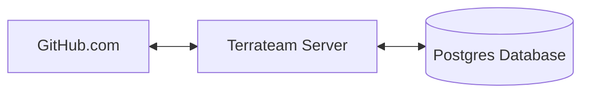
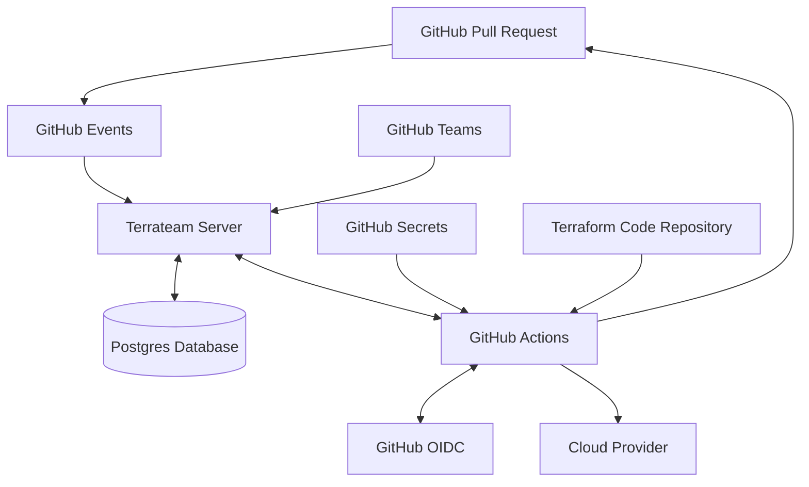

  

  <a href="https://terrateam.io/docs">Docs</a> - <a href="https://terrateam.io/docs/using-terrateam">Using Terrateam</a> - <a href="https://terrateam.io/slack">Support community</a> - <a href="https://roadmap.terrateam.io/">Roadmap</a> - <a href="https://github.com/terrateamio/terrateam/issues/new?assignees=&labels=bug&template=bug_report.md">Bug report</a>  
Start running Terraform with cost estimation, security alerts, drift detection, access controls, and OPA policy testing. Self-hosted and cloud versions available.

## Terraform continuous delivery for GitHub

Create Terraform changes by commenting on pull requests.

Terrateam delivers self-service Terraform across your organization, visibility into cloud spend, an expressive configuration file with fine-grained access controls, drift detection, policy enforcement, security alerts, and more.

## Table of contents

- [Features](#features)
- [Get started for free](#get-started-for-free)
- [How it works](#how-it-works)
- [Cloud vs. Self-Hosted](#cloud-vs-self-hosted)
- [Docs](#docs)
- [Support](#support)

**⭐ Like us? Give us a star!**

## Features

- [Access Control](https://terrateam.io/docs/features/access-control) - Define a set of capabilities, such as `plan` and `apply`, and which users can perform those operations. GitHub Users, Teams, and Repository Collaborator policies are supported.
- [Apply Requirements](https://terrateam.io/docs/features/apply-requirements) - Specify when an `apply` operation can be performed on a pull request that has not been merged.
- [Cost Estimation](https://terrateam.io/docs/features/cost-estimation) - Cost estimates on each pull request that Terrateam runs a `plan` operation against.
- [Drift Detection](https://terrateam.io/docs/features/drift-detection) - Scheduled operations to detect drift between live infrastructure and your Terraform repository.
- [OIDC](https://terrateam.io/docs/features/oidc) - Safely and securely authenticate to your cloud provider using temporary credentials.
- [OPA Policy Testing](https://terrateam.io/docs/features/policy-testing) - Policy testing against `plan` operations with [OPA](https://www.openpolicyagent.org/) and [Conftest](https://www.conftest.dev/).
- [Static Analysis](https://terrateam.io/docs/features/static-analysis) - Static analysis against `plan` operations with [Checkov](https://www.checkov.io/).
- [Workflows](https://terrateam.io/docs/features/workflows) - Custom workflows to replace the default Terrateam steps for `plan` and `apply` operations.

## Get started for free

### Terrateam Cloud

The fastest way to get started with Terrateam is signing up for [Terrateam Cloud](https://terrateam.io/docs/getting-started).

### Terrateam Self-Hosted

This plan covers our Kubernetes and Docker compose deployment with limited usage and without guarantee. This deployment is designed for evaluating Terrateam without vendor approval. It is not designed for production use.

#### Architecture

The following diagram shows an overview of the Terrateam architecture.

> The Terrateam application server is horizontally scalable. You can run as many as you'd like as long as they all point to the same Postgres database.

```mermaid
graph LR
    gh[GitHub.com]
    ts[Terrateam Server]
    pd[(Postgres Database)]
    gh <--> ts
    ts <--> pd
```

## Deployment instructions

See the [Terrateam docs](https://terrateam.io/docs/self-hosted) for deployment instructions.

## How it works

Terrateam is a GitHub application that turns pull requests into Terraform executions using GitHub Actions. There are two major components of the Terrateam service:

- The server which receives GitHub pull request events and makes decisions using the event payload
- The Terrateam GitHub Actions runner which executes the Terraform jobs that the Terrateam server creates

> 🔒 Cloud credentials and source code never reach our servers. Sensitive information is isolated to your organization GitHub Actions runtime environment. The Terrateam GitHub Action is open-source and can be found [here](https://github.com/terrateamio/action). See our [Security](https://terrateam.io/security) page for more information.

```mermaid
graph TD
    gpr[GitHub Pull Request]
    ge[GitHub Events]
    ts[Terrateam Server]
    pd[(Postgres Database)]
    ga[GitHub Actions]
    gt[GitHub Teams]
    go[GitHub OIDC]
    gs[GitHub Secrets]
    cp[Cloud Provider]
    tr[Terraform Code Repository]
    gpr --> ge
    ge --> ts
    ts <--> pd
    ts <--> ga
    ga --> gpr
    gt --> ts
    ga <--> go
    gs --> ga
    ga --> cp
    tr --> ga
```

See our [documentation](https://terrateam.io/docs/how-it-works) to learn more about execution steps, types of operations, event evaluations, locking, and more.

## Docs

Check out our [documentation](https://terrateam.io/docs) for getting started instructions, example use cases, and tutorials.

## Support

We encourage users to submit a [GitHub Issue](https://github.com/terrateamio/terrateam/issues). Additionally, if you need help, have a feature request, or anything else, please hop onto our [Slack](https://terrateam.io/slack). This is often times the fastest way to talk to us.
