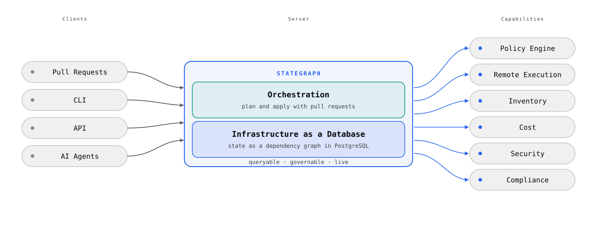

<p align="center">
  <a href="https://stategraph.com">
    <picture>
      <source media="(prefers-color-scheme: dark)" srcset="https://raw.githubusercontent.com/stategraph/brand-artifacts/c6f63a114680a786452b2f28af87637c66c3ec10/logos/wordmark/stategraph_logo_wordmark_white.svg">
      
    </picture>
  </a>
</p>

<h3 align="center">Terraform without the state file bottleneck</h3>

<p align="center">
  One state file means one global lock. Stategraph replaces it with a dependency graph.<br>
  Plan and apply time is proportional to the size of your change, not the size of your state file,<br>
  and changes that touch different resources run at the same time.
</p>

> [!NOTE]
> Terrateam and Stategraph have merged into one platform. We're transitioning gradually; existing Terrateam setups keep working unchanged. During the transition:
>
> Stategraph Orchestration (formerly Terrateam) → [app.terrateam.io](https://app.terrateam.io) · [docs.terrateam.io](https://docs.terrateam.io)  
> Stategraph Infrastructure as a Database → [app.stategraph.cloud](https://app.stategraph.cloud)

<p align="center">
  <a href="https://stategraph.com">Website</a> ·
  <a href="https://stategraph.com/docs">Docs</a> ·
  <a href="https://stategraph.com/blog">Blog</a> ·
  <a href="https://terrateam.io/slack">Slack</a>
</p>

<p align="center">
  <a href="https://github.com/stategraph/stategraph/stargazers"></a>
  <a href="https://github.com/stategraph/releases/releases"></a>
  <a href="https://terrateam.io/slack"></a>
  <a href="https://ocaml.org"></a>
  <a href="https://opensource.org/licenses/MPL-2.0"></a>
</p>

---

## What is Stategraph?

Every Terraform team hits the same wall. Any operation that can write state locks the entire state file. When two changes touch nothing in common, the second one still fails with `Error acquiring the state lock`, and a human retries it. The lock is the size of the file, not the size of the change, and no wrapper on top of Terraform can fix that, because the lock lives in the data model.

Stategraph is one platform that meets you on both sides of that wall:

* **Stategraph Orchestration**: GitOps for Terraform and OpenTofu on GitHub and GitLab. Plan and apply from pull requests, policy and cost checks built in. Adopted in an afternoon, free for small teams.
* **Stategraph Infrastructure as a Database**: the state engine that removes the global lock. Your state becomes a dependency graph in PostgreSQL. Plans are scoped to the subgraph your change touches, conflicts are detected per resource at commit, and SQL runs across every state you have. Works standalone with any workflow, no VCS provider required.

Neither requires the other. Orchestration works without the database, and the database works without Orchestration. Start with pull-request automation, and when one lock per state file starts deciding who ships today, graduate to the engine that removes it. Same platform, same PRs; you turn more of it on.

<div align="center">
  <picture>
    <source media="(prefers-color-scheme: dark)" srcset="assets/stategraph-platform-dark.svg">
    
  </picture>
</div>

## Ship from the pull request

Open a pull request and the plan shows up as a comment. Apply from the PR when you're ready. That's the whole workflow.

* **Auto plan on every PR**, posted as a comment
* **Apply from the pull request**, with approvals routed by CODEOWNERS
* **Policy enforcement** with OPA/Rego, Conftest, and Checkov to block non-compliant changes before production
* **Cost estimates** in review, not on the invoice, with thresholds that require extra approval
* **Drift detection** on a schedule, not on a hunch
* **Built for scale** with tag-based configuration for 10 or 10,000 workspaces, monorepo or many repos
* **Works with** Terraform, OpenTofu, Terragrunt, CDKTF, and Pulumi

Runs on GitHub and GitLab. Configure workflows via `.terrateam/config.yml`. See the [Terrateam docs](https://docs.terrateam.io).

## Drop the global lock

Terraform state is a dependency graph. Stategraph stores it like one, as a graph in PostgreSQL on a server you can query, instead of one JSON blob behind one lock. Removing the lock buys you exactly three things:

**1. Faster plans and applies.** Plans are scoped to the subgraph your change touches. Refresh, plan, and apply do work proportional to the size of your change, not the size of your infrastructure.

**2. Concurrent changes.** Overlapping resources serialize; everything else lands in parallel. On conflict, the commit is rejected with the conflicting transaction ID. Re-plan, retry. No `force-unlock`, no Slack channel for the lock.

<div align="center">
  <picture>
    <source media="(prefers-color-scheme: dark)" srcset="assets/subgraph-execution-dark.svg">
    
  </picture>
</div>

<p align="center"><i>Illustrative timing. The ordering is real; the seconds are simulated.</i></p>

**3. Visibility across everything you run.** SQL across every state you have: JOINs, CTEs, blast radius before you merge.

```console
$ stategraph query "SELECT type, count(*) FROM resources GROUP BY type"
 aws_instance         20
 aws_security_group   15
 aws_subnet            6
```

Every change is a transaction with an inspectable timeline, so the audit trail isn't a log you assemble; it's the execution record. Cross-state changes commit atomically with `stategraph tf mtx`.

Ship from the CLI too. With remote execution, `stategraph plan` and `stategraph apply` feel local. You run the command and output streams to your terminal. Execution happens on remote agents, where the secrets and infrastructure access actually live, never in the environment that typed the command.

## Get started

### Stategraph Orchestration

**Hosted:** [Start free](https://terrateam.io). Connects to GitHub or GitLab, free for small teams.

**Self-hosted:**

```bash
git clone https://github.com/stategraph/stategraph
cd stategraph/docker/terrat

# Run the setup wizard
docker compose up setup
# then open http://localhost:3000
```

### Stategraph Infrastructure as a Database

You need a running Stategraph server first. Pick one:

**Hosted:** [Stategraph Cloud](https://app.stategraph.cloud). We run the server; the fastest way to start.

**Self-hosted:** in your VPC, on your PostgreSQL, deployed with Docker Compose, Kubernetes, ECS, or Cloud Run. See [deployment options](https://stategraph.com/docs/deployment).

**BYOC:** we operate Stategraph inside your AWS, GCP, or Azure account. [Talk to us](https://stategraph.com/contact).

Then install the CLI and point it at your server:

```bash
curl -sSL https://get.stategraph.com/install.sh | sh

export STATEGRAPH_API_BASE="https://your-server.example.com"
export STATEGRAPH_API_KEY="<your-api-key>"        # console: Settings → API Keys
export STATEGRAPH_TENANT_ID="<your-tenant-id>"    # shown in stategraph info

stategraph info                     # confirm the connection
```

Then import your first state. It's an import, not a rewrite:

```bash
terraform state pull > terraform.tfstate
stategraph import tf --name networking terraform.tfstate
stategraph plan                     # you're on the graph
```

* **Your Terraform, unmodified**: Stategraph drives the Terraform or OpenTofu binary you already use. No provider changes, no HCL edits; `terraform plan`/`apply` becomes `stategraph plan`/`apply`.
* **No VCS provider required**: the CLI talks to the server directly. Use it with Orchestration, with your existing CI, or from your laptop.
* **Credentials stay with you**: the CLI runs Terraform where you run it. The server stores state; it never runs Terraform and never sees your cloud.
* **Reversible**: `stategraph states export` writes a standard `terraform.tfstate` back out. Try it on one state. If it's not for you, export and go back to the backend you came from.

The full walkthrough, including exploring what you imported, is in the [quickstart](https://stategraph.com/docs/getting-started/quickstart).

## Learn more

* [Quickstart](https://stategraph.com/docs/getting-started/quickstart): zero to querying your infrastructure in about ten minutes
* [Core concepts](https://stategraph.com/docs/getting-started/concepts): states, transactions, and the graph
* [Terrateam docs](https://docs.terrateam.io): PR workflows, policy, cost, drift for Orchestration
* [CLI reference](https://stategraph.com/docs/cli): every command
* [Orchestration pricing](https://terrateam.io/pricing): free for small teams, flat price as you grow
* [Infrastructure as a Database pricing](https://stategraph.com/pricing): annual contract, available standalone

## Coming from Terrateam?

You're in the right place, and nothing changes for you today. Terrateam is becoming Stategraph Orchestration: same engine, same team, one platform. We're doing the move gradually rather than flipping a switch, so for now:

* Hosted Terrateam keeps running at [terrateam.io](https://terrateam.io), and that's still where you sign up for Orchestration
* The [Terrateam docs](https://docs.terrateam.io) remain the reference for PR automation
* Your existing setup and `.terrateam/config.yml` keep working unchanged

As pieces move over to Stategraph, we'll say so here and in the docs.

## Community

* [Slack](https://terrateam.io/slack): chat with the team and other users
* [GitHub Discussions](https://github.com/orgs/stategraph/discussions): questions and ideas
* [GitHub Issues](https://github.com/stategraph/stategraph/issues): bugs and feature requests

## Contributing

We welcome contributions! See [CONTRIBUTING.md](CONTRIBUTING.md).

## License

The code in this repository is [MPL-2.0](LICENSE) licensed.

Stategraph Infrastructure as a Database is commercial software, available in the hosted service or self-hosted with a license key. Stategraph Orchestration is open source, with enterprise features (RBAC, centralized configuration, advanced approval workflows) available in the hosted service and the self-hosted Enterprise Edition.
