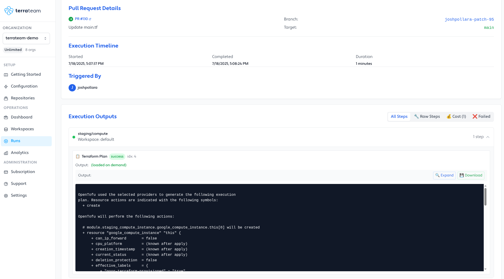

<p align="center">
  <picture>
    <source media="(prefers-color-scheme: dark)" srcset="https://raw.githubusercontent.com/terrateamio/brand-artifacts/fa9cb8e10b09478065fc2566e486d4c65d1eb912/logos/wordmark/blue%3Awhite/terrateam_wordmark_blue-white.svg">
    
  </picture>
</p>
<p align="center">
  <a href="https://github.com/terrateamio/terrateam/stargazers"></a>
  <a href="https://terrateam.io/slack"></a>
  <a href="https://github.com/terrateamio/mono/releases"></a>
  <a href="https://ocaml.org"></a>
  <a href="https://opensource.org/licenses/MPL-2.0"></a>
</p>

---

## Open-Source Terraform automation in pull requests

Terrateam automates Terraform plans and applies in pull requests. Open source, integrates with GitHub and GitLab, and easy to self-host.

* Infrastructure as Code automation for Terraform, OpenTofu, Terragrunt, CDKTF, Pulumi, any CLI
* Flexible policies, approvals, and cost checks
* Multi-environment coordination and deployment workflows
* Reporting UI to track runs, pull requests, locks, and more

---

<div align="center">
  
</div>


### What makes Terrateam different?

* **GitOps**: Runs `terraform plan` and `apply` in pull requests. Controlled by a `.terrateam/config.yml` file that maps directories, tags, policies, and approvals.
* **Flexible**: Works with any Terraform-compatible CLI: OpenTofu, Terragrunt, CDKTF, Pulumi, and more. Fully configured through YAML.
* **Policies**: Enforce rules with Rego, Checkov, or built-in policies. Require approvals by team, role, or user.
* **Drift and cost detection**: Catch infrastructure drift and show cost estimates in pull requests automatically.
* **Self-hostable and horizontally scalable**: Stateless by design. Deploy Terrateam on your infrastructure and scale out using standard Postgres and CI runners.
---

## Try Terrateam

### Hosted SaaS

[Start free →](https://terrateam.io)

### Self-Hosted

#### Quick Start

```bash
# Clone the repository
git clone https://github.com/terrateamio/terrateam
cd terrateam/docker/terrat

# Run the setup
docker-compose up setup

# The Terrateam setup wizard will be available at http://localhost:3000
```
---

## Features

* GitOps pull request automation
* Pre and post-merge applies
* RBAC + OIDC integration
* Policy enforcement (OPA, Rego, Checkov, built-in)
* Cost estimation
* Safe parallel execution with locking
* Cross-environment and dependency coordination
* Config builder for advanced workflows
* Self-hostable (server and private runners)

---

## Configuration

Configure workflows via `.terrateam/config.yml`. See [Configuration Reference](https://docs.terrateam.io/configuration-reference).

---

## Resources

* [Documentation](https://docs.terrateam.io)
* [Quickstart Guide](https://docs.terrateam.io/getting-started/quickstart-guide)
* [Blog](https://terrateam.io/blog)
* [Configuration Reference](https://docs.terrateam.io/configuration-reference)
* [Community Slack](https://terrateam.io/slack)

---

## Contributing

We welcome contributions! See [CONTRIBUTING.md](CONTRIBUTING.md) or join our [Slack](https://terrateam.io/slack).

---

## License

Terrateam is MPL-2.0 licensed. Some enterprise features are under a separate enterprise license.
