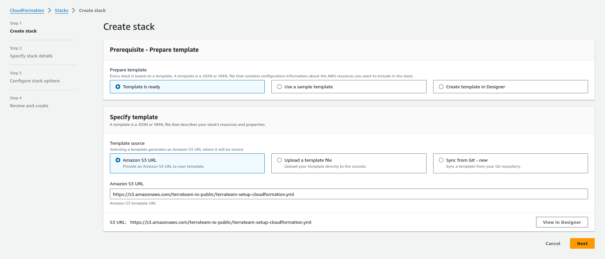
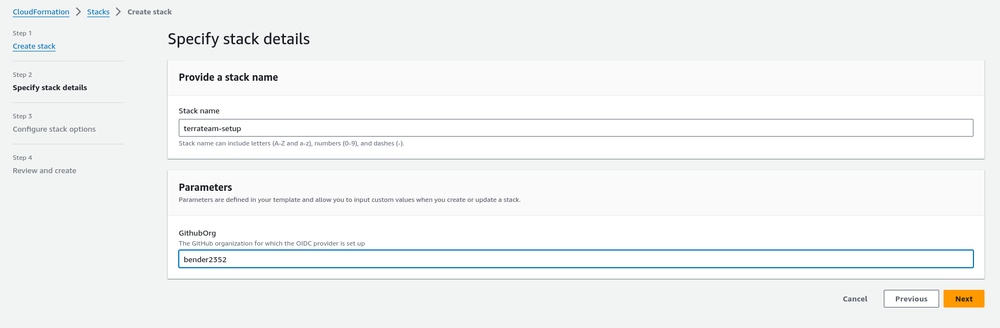
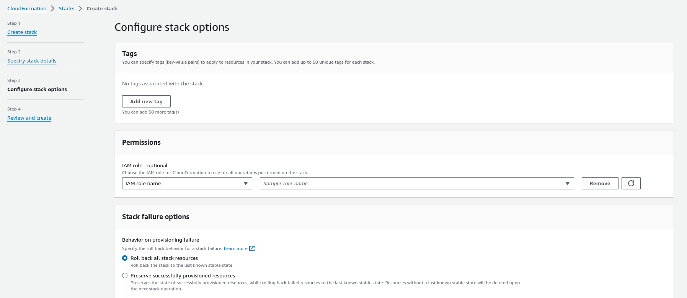
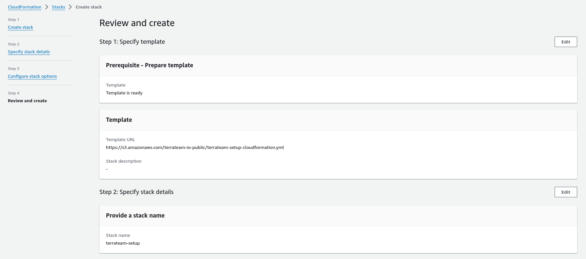

import { Steps } from '@astrojs/starlight/components';
import { Card } from '@astrojs/starlight/components';
import { Tabs, TabItem } from '@astrojs/starlight/components';

<Card title="What is OIDC?" icon="information">
OpenID Connect (OIDC) allows your GitHub Actions workflows to access resources in AWS without storing any credentials as long-lived GitHub secrets. This is the most secure authentication method for production environments.
</Card>

## Quick Setup (Recommended)

The fastest way to get OIDC working is with our automated tools. Choose your preferred method:

<Tabs>
  <TabItem label="Terraform">

Use our [Terraform module](https://github.com/terrateamio/terraform-aws-terrateam-setup) to create all AWS resources that Terrateam requires.

:::caution[Run this locally]
This setup should be run **locally on your workstation**, not through Terrateam. You'll need:
- Terraform installed locally
- AWS credentials configured locally (AWS CLI or environment variables)
- This is a one-time setup to give Terrateam access to your AWS account
:::

<Steps>

1. ### Create `main.tf` on your workstation

   :::note
   Replace `GITHUB_ORG` with your GitHub organization name or username. This is case-sensitive.
   :::

   ```hcl
   module "terraform_aws_terrateam_setup" {
     source               = "github.com/terrateamio/terraform-aws-terrateam-setup"
     github_org           = "GITHUB_ORG" # GitHub organization or username
     aws_policy_arn       = "arn:aws:iam::aws:policy/PowerUserAccess"  # Suggested policy - customize as needed
     aws_iam_role_name    = "terrateam"
     create_oidc_provider = true
   }
   ```

2. ### Apply changes locally

   ```sh
   terraform apply
   ```

</Steps>

  </TabItem>
  <TabItem label="AWS CLI">

Use the [CloudFormation template](https://terrateam-io-public.s3.us-east-2.amazonaws.com/terrateam-setup-cloudformation.yml) via AWS CLI:

### Create the Stack

:::note
Replace `GITHUB_ORG` with your GitHub organization name or username. This is case-sensitive.
:::

```sh
aws cloudformation create-stack \
--stack-name terrateam-setup \
--template-url https://terrateam-io-public.s3.us-east-2.amazonaws.com/terrateam-setup-cloudformation.yml \
--parameters ParameterKey=GithubOrg,ParameterValue=GITHUB_ORG \
ParameterKey=RoleArn,ParameterValue=arn:aws:iam::aws:policy/PowerUserAccess \
ParameterKey=CreateGithubOIDCProvider,ParameterValue=true \
ParameterKey=RoleName,ParameterValue=terrateam \
--capabilities CAPABILITY_NAMED_IAM
```

:::tip[Policy Choice]
`PowerUserAccess` is suggested for quick setup. Replace with any IAM policy ARN that fits your security requirements.
:::

  </TabItem>
  <TabItem label="AWS Console">

Use the CloudFormation template through the AWS Console:

<Steps>

1. ### Navigate to CloudFormation

   Navigate to `CloudFormation` in the AWS Console to create the stack.

   :::note
   Input the Terrateam CloudFormation template Amazon S3 URL:
   ```
   https://terrateam-io-public.s3.us-east-2.amazonaws.com/terrateam-setup-cloudformation.yml
   ```
   :::

   

2. ### Specify Stack Details

   :::note
   Specify `GithubOrg` (case-sensitive) and set `RoleArn` to `arn:aws:iam::aws:policy/PowerUserAccess`, or choose another IAM policy that suits your needs.
   :::
   
   

3. ### Configure Stack Options

   :::note
   Additional stack options aren't required for Terrateam.
   :::

   

4. ### Review and Create the Stack

   

</Steps>

  </TabItem>
</Tabs>

## Configure Terrateam for OIDC

After setting up AWS resources, configure Terrateam to use OIDC authentication:

<Steps>

1. ### Create Configuration File

   Create the `.terrateam/config.yml` configuration file at the root of your Terraform repository.

2. ### Add OIDC Hook

   :::note
   Replace `AWS_ACCOUNT_ID` with your AWS account ID.
   :::

   ```yml
   hooks:
     all:
       pre:
         - type: oidc
           provider: aws
           role_arn: "arn:aws:iam::AWS_ACCOUNT_ID:role/terrateam"
   ```

</Steps>

## Manual Setup (Advanced)

<details>
  <summary>Need to set up OIDC manually? Expand for step-by-step instructions</summary>

For custom configurations or when you need to understand exactly what resources are being created:

<Steps>

1. ### Create OIDC Provider

   Create the OIDC provider in AWS to trust GitHub's identity provider:

   ```sh
   aws iam create-open-id-connect-provider \
   --url https://token.actions.githubusercontent.com \
   --client-id-list sts.amazonaws.com \
   --thumbprint-list 6938fd4d98bab03faadb97b34396831e3780aea1 1c58a3a8518e8759bf075b76b750d4f2df264fcd
   ```

2. ### Create Trust Policy

   Create a local file on your workstation named `trustpolicy.json`. This defines the policy allowing AWS to trust GitHub's OIDC as a federated identity.

   :::note
   Replace `AWS_ACCOUNT_ID` and `GITHUB_ORG` with your actual values. `GITHUB_ORG` is case-sensitive and represents your GitHub organization name or username.
   :::

   ```json
   {
     "Version": "2012-10-17",
     "Statement": [
       {
         "Effect": "Allow",
         "Principal": {
           "Federated": "arn:aws:iam::AWS_ACCOUNT_ID:oidc-provider/token.actions.githubusercontent.com"
         },
         "Action": "sts:AssumeRoleWithWebIdentity",
         "Condition": {
           "StringLike": {
             "token.actions.githubusercontent.com:sub": "repo:GITHUB_ORG/*"
           },
           "StringEquals": {
             "token.actions.githubusercontent.com:aud": "sts.amazonaws.com"
           }
         }
       }
     ]
   }
   ```

   **Example Trust Policies:**
   - [Single repository access](https://github.com/terrateamio/terrateam-example/blob/main/aws/oidc/trustpolicy/single-repository/trustpolicy.json)
   - [Multiple repositories access](https://github.com/terrateamio/terrateam-example/blob/main/aws/oidc/trustpolicy/multiple-repositories/trustpolicy.json)

3. ### Create IAM Role

   Create the `terrateam` IAM role using the trust policy:

   ```sh
   aws iam create-role \
   --role-name terrateam \
   --assume-role-policy-document file://trustpolicy.json
   ```

4. ### Attach Permissions Policy

   Attach an IAM policy to give the role necessary permissions. We suggest `PowerUserAccess` as a starting point:

   ```sh
   aws iam attach-role-policy \
   --policy-arn arn:aws:iam::aws:policy/PowerUserAccess \
   --role-name terrateam
   ```

   :::note[Choose Your Policy]
   `PowerUserAccess` is just a suggestion. Choose the policy that best fits your security requirements:
   - **PowerUserAccess** - Broad permissions, good for testing
   - **Custom policy** - More restrictive, recommended for production
   - **Other AWS managed policies** - Based on your specific needs
   :::

5. ### Configure Terrateam

   Follow the [Configure Terrateam for OIDC](#configure-terrateam-for-oidc) section above to complete your setup.

</Steps>

</details>

## Advanced Configuration

:::tip[Multiple Environments]
You can use different IAM roles for different environments and operations. For example:

```yml
workflows:
  - tag_query: "dir:terraform/production/**"
    plan:
      - type: oidc
        provider: aws
        role_arn: "arn:aws:iam::PROD_ACCOUNT_ID:role/terrateam-prod"
      - type: init
      - type: plan
    apply:
      - type: oidc
        provider: aws
        role_arn: "arn:aws:iam::PROD_ACCOUNT_ID:role/terrateam-prod"
      - type: init
      - type: apply
  - tag_query: "dir:terraform/staging/**"
    plan:
      - type: oidc
        provider: aws
        role_arn: "arn:aws:iam::STAGING_ACCOUNT_ID:role/terrateam-staging"
      - type: init
      - type: plan
    apply:
      - type: oidc
        provider: aws
        role_arn: "arn:aws:iam::STAGING_ACCOUNT_ID:role/terrateam-staging"
      - type: init
      - type: apply
```

For more details, read the [Cloud Credentials documentation](/advanced-workflows/cloud-credentials).
:::

## Next Steps

Now that you have AWS authentication configured, you are now able to use Terrateam for plan and apply operations against AWS resources.

- Learn about [advanced workflows](/advanced-workflows/) for complex setups
- Configure [multiple environments](/advanced-workflows/multiple-environments)
- Set up [apply requirements](/security-and-compliance/apply-requirements-and-overrides) for additional security
