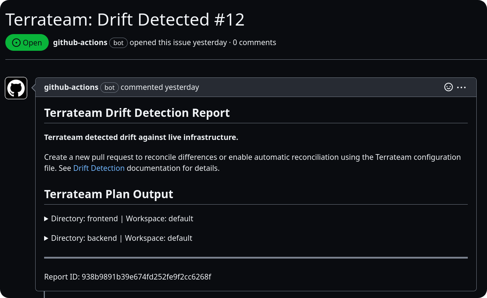

The `drift` configuration can be used to control drift detection and reconciliation schedules in a repository.

## Default Configuration
```yaml
drift:
  enabled: false
  reconcile: false
```

## Keys
| Key | Type | Description |
|-----|------|-------------|
| enabled | Boolean | Specifies whether drift detection is enabled. If set to false, drift detection and reconciliation will not run. Default is false. |
| schedule | String | The interval to run drift detection and reconciliation: hourly, daily, weekly, monthly. |
| reconcile | Boolean | Specifies whether reconciliation is enabled. Default is false. |
| tag_query | String | A tag query that specifies which directories and workspaces drift detection and reconciliation should be applied to. |

## Examples
### Enabling Drift Detection
```yaml
drift:
  enabled: true
  schedule: daily
```
This configuration will enable drift detection and run it on a daily schedule.

### Enabling Drift Detection with Reconciliation
```yaml
drift:
  enabled: true
  reconcile: true
  schedule: weekly
```
This configuration will enable drift detection with automatic reconciliation and run it on a weekly schedule.

### Using Tag Queries to Limit Scope
```yaml
drift:
  enabled: true
  schedule: hourly
  tag_query: 'dir:production'
```
This configuration will enable drift detection, run it on an hourly schedule, and limit it to to the `dir:production` [tag query](/advanced-workflows/tags).

## Schedule
The `schedule` key can be set to one of the following values:
- `hourly`
- `daily`
- `weekly`
- `monthly`
:::info
There is no default value for `schedule`, and this key is required when drift detection is enabled.
:::

## Reconciliation
The `reconcile` key enables or disables automatic reconciliation. When enabled, if changes are found during drift detection, an apply operation will automatically run against the generated Terraform plan to reconcile the infrastructure state.

## Notifications
### GitHub Issues
If changes are found during drift detection, a GitHub Issue can be automatically created by adding the following configuration:
```yaml
hooks:
  plan:
    post:
      - type: drift_create_issue
```
Duplicate issues for identical changes will not be created.


### Slack
You can create Slack notifications using the official [GitHub Integration for Slack](https://github.com/integrations/slack):
- Install the app in your desired Slack workspace and channel.
- Use the `/github` command to subscribe to your Terraform repository:
   ```
   /github subscribe owner/repo issues
   ```

### Custom Notifications
To create custom notifications or actions when drift detection finds changes, you can implement a custom hook:
```yaml
hooks:
  plan:
    post:
      - type: run # run drift-notify.sh on every drift run with changes
        cmd: ['bash', '-c', '$TERRATEAM_ROOT/drift-notify.sh']
```

`drift-notify.sh`:
```bash
#!/usr/bin/env bash
set -e
if [[ "$TERRATEAM_RUN_KIND" == "drift" ]] && [[ -f "$TERRATEAM_RESULTS_FILE" ]]; then
  echo "This is a drift operation"
fi
```

## Considerations
When configuring drift detection, keep the following in mind:
- Drift detection operations are equivalent to plan operations. Existing [workflows](/configuration-reference/workflows) and [hooks](/configuration-reference/hooks) run for all drift detection operations.
- The following environment variable is defined for plan and apply operations initiated by drift detection: `TERRATEAM_RUN_KIND=drift`
- If reconciliation is enabled, changes will be automatically applied without manual review or approval. Ensure that you have appropriate safeguards and testing in place before enabling automatic reconciliation.
- Drift detection can generate a significant number of GitHub Issues if changes are frequently detected. Consider using appropriate filters, such as the `tag_query` key, to limit the scope of drift detection and reduce noise.
- Custom notifications and actions can be implemented using hooks and scripts to integrate drift detection with your existing monitoring and alerting systems.
