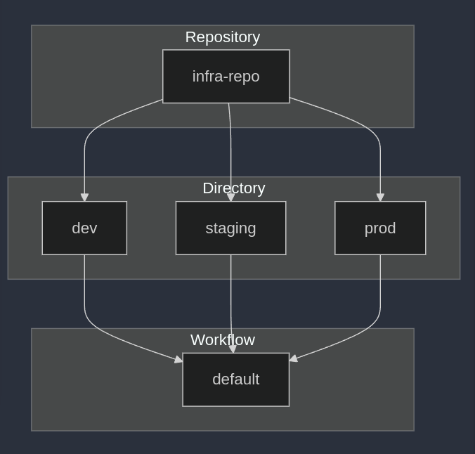

To effectively use Terrateam, it's important to understand its key concepts and terminology. In the following section, we'll explore the core components of Terrateam and how they work together to simplify your infrastructure management workflow.

:::note
 Default settings work for most teams. Customize only if you need specific lock timing or policies.
:::

## Dirspace

In Terrateam, a Dirspace is a fundamental concept that defines the scope of Terraform operations. It uniquely combines a `repository`, a `directory` within that repository, and a Terraform `workspace`, represented as a tuple `(repository, directory, workspace)`.

Dirspaces are automatically created when Terrateam detects Terraform configurations in your repository. Each directory containing Terraform files creates a Dirspace with either its explicitly configured workspace or the **default workspace** (created automatically when no specific workspace is defined).

:::note
Terrateam executes operations like plan and apply within the context of a Dirspace: a combination of directory and Terraform workspace.
:::

Consider you have a repository called `infra-repo` managing multiple environments:



Each environment (`dev`, `staging`, `prod`) lives in a separate directory and uses the default Terraform workspace:

```
Repository: infra-repo
  |
  |-- dev/
  |    |-- Workspace: default
  |
  |-- staging/
  |    |-- Workspace: default
  |
  |-- prod/
       |-- Workspace: default
```

## Changes and File Patterns

When a pull request is opened or updated, Terrateam detects changes based on patterns defined in your `.terrateam/config.yml` file under the [`when_modified`](/configuration-reference/when-modified) configuration. The default configuration looks like:

```yaml
when_modified:
  file_patterns:
    - '**/*.tf'
    - '**/*.tfvars'
```

This configuration instructs Terrateam to monitor changes to any files with `.tf` or `.tfvars` extensions. Adjust these patterns in your configuration file to align with your project's structure.

Terrateam maps detected changes to their appropriate [Dirspaces](/getting-started/concepts#dirspace). These mapped Dirspaces are referred to as Changes. When executing operations, Terrateam only considers Dirspaces with modified files in the pull request.

## Auto-Plan and Auto-Apply

Terrateam provides automated Terraform execution workflows to simplify infrastructure changes:

- **Auto-Plan**: Runs `terraform plan` automatically when a pull request is created or updated. Enable with:
  ```yaml
  when_modified:
    autoplan: true  # Set to false to disable
  ```
- **Auto-Apply**: Runs `terraform apply` post-merge. It is disabled by default. Enable with:
  ```yaml
  when_modified:
    autoapply: true
  ```

## Tags and Tag Sets

Terrateam uses [Tags](/advanced-workflows/tags) to organize Terraform resources through flexible labeling. Tags provide a powerful way to categorize, filter, and manage your infrastructure resources, making it easier to apply specific operations to targeted sets of resources.

Tags in Terrateam can be both user-defined and automatically assigned. They are optional but provide significant benefits for organizing and managing infrastructure resources.
:::note
Users can define custom tags in their Terrateam configuration file (`.terrateam/config.yml`).
:::

There are two types of Tags:

- **Tag Set**: An unordered and deduplicated list of labels assigned to Terraform resources.
- **Tag Query**: A Tag Set used for matching. Every Tag in a Tag Query must exist in a Tag Set for a match to occur. Check the [Tag Queries](/getting-started/tag-queries) page to lean more.

## Lock policy

Terrateam's locking system prevents concurrent modifications by ensuring only one change can be applied to a resource at a time. This prevents:

- State file conflicts.
- Resource modification races.
- Concurrent apply operations.

Key behaviors:
- Enabled by default (no config needed).
- Automatically released after apply + merge.
- Force unlock via comment: `terrateam unlock`.

Customizing lock policies:
```yaml
# .terrateam/config.yml (default shown)
workflows:
  lock_policy: strict  # strict|apply|merge|none
```

For advanced configurations see our [Locks & Concurrency guide](/advanced-workflows/locks-and-concurrency).
