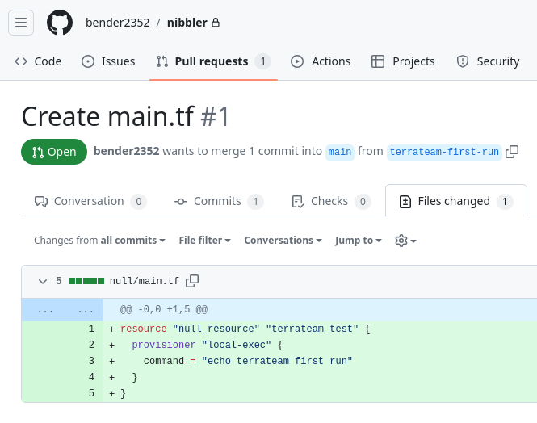
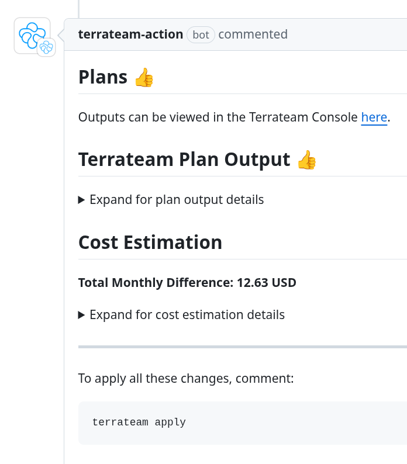
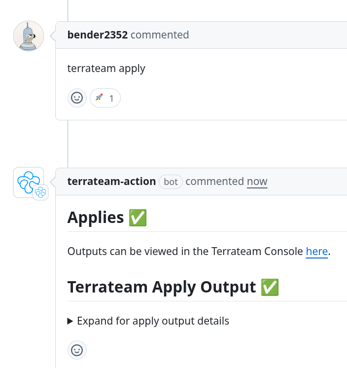

import { Steps } from '@astrojs/starlight/components';
import { Card, CardGrid } from '@astrojs/starlight/components';

The Plan and Apply operations are the core of Terrateam's functionality. They allow you to preview and execute changes to your infrastructure in a controlled and collaborative manner.

## Plan

The Plan operation generates a preview of changes that will be made to your infrastructure when you apply your Terraform code. This preview is called a "plan" in Terraform terminology.

The following example shows a common usage of the plan feature, enabling you to review changes and collaborate with your team before the changes are applied:
<Steps>
1. Open a pull request with changes to your Terraform code.

   

2. Terrateam automatically triggers a Plan operation.

3. Review the plan output in the PR comment. It shows what will be created, modified, or destroyed:

    

</Steps>

You can manually trigger another Plan by commenting `terrateam plan` on the pull request.

:::note
Plans are read-only operations that don't change your infrastructure, so they're safe to run repeatedly as you refine your code.
:::

## Apply

The Apply operation executes the changes previewed in the Plan. This is when actual infrastructure changes occur.
Here's an example of a common usage of the apply feature:
<Steps>
1. Ensure your pull request has a successful Plan operation.

2. Comment `terrateam apply` on the pull request.

3. Terrateam acquires a lock on the affected directories to prevent conflicting changes.

4. Terrateam runs the Apply operation:

   

5. Verify the apply was successful by reviewing the output.

6. Merge the pull request to complete your workflow.

7. Terrateam automatically releases the lock.
</Steps>

:::caution
If another PR is trying to apply changes to the same directory, it will be blocked until the [current lock is released](/advanced-workflows/locks-and-concurrency/). Locks prevent conflicting changes from being applied simultaneously.
:::


### Apply Requirements

Terrateam has a set of [Apply Requirements](/configuration-reference/apply-requirements) that must be met before an Apply operation can be triggered. These include:

- Requiring a certain number of [approvals](/configuration-reference/apply-requirements#approved) on the pull request.
- Ensuring there are no [merge conflicts](/configuration-reference/apply-requirements#merge-conflicts).
- Checking that all [status checks](/configuration-reference/apply-requirements#status-checks) have passed.

You can configure these requirements in your [Terrateam configuration file](/getting-started/configuration).
### Auto-Apply
If you want to automatically apply changes when a pull request is merged, you can use the [When Modified](/configuration-reference/when-modified) feature.
```yaml
when_modified:
  autoapply: true
```
:::note 
   Auto-Apply is disabled by default.
:::
## Apply Before Merge vs. After Merge
Terrateam supports two main approaches based on when infrastructure changes are applied, either before or after a pull request is merged. This flexibility lets you match your deployment process to your team's needs.

Terrateam lets you define the sequence of steps during Plan and Apply. You can customize these steps to enforce approvals, manage concurrency, or trigger applies at the right time.

If you want to validate and apply changes before merging, you can use a pre-merge approach combined with [automerge](/configuration-reference/automerge) to apply changes automatically once checks pass.
