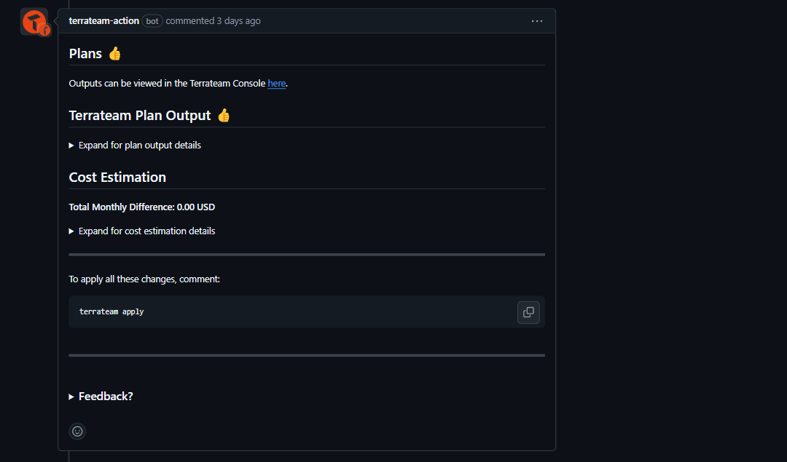
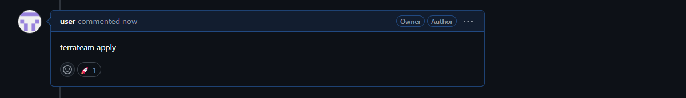

import { Steps, Code } from '@astrojs/starlight/components';


Terrateam seamlessly integrates with GitHub's pull request workflow, allowing you to trigger Terraform operations directly from your pull requests. This section will guide you through the different ways Terrateam can be triggered and how to use pull requests effectively with Terrateam.

## Triggering Terrateam

Terrateam supports several methods to trigger Terraform operations:

#### **Opening a Pull Request**
When you open a new pull request containing changes to your Terraform code, Terrateam automatically detects the changes and triggers a Plan operation. This allows you to review the proposed changes before applying and merging them into your main branch.

#### **Updating a Pull Request**
If you push additional commits to a pull request, Terrateam will re-run the Plan operation to ensure that the proposed changes are up to date.

#### **Commenting on a Pull Request**
You can manually trigger Terrateam operations by adding comments to your pull request. Terrateam supports the following commands:

| Comment           | Action                                                                          |
|-------------------|---------------------------------------------------------------------------------|
| `terrateam apply` | Triggers an apply operation, applying the changes proposed in the pull request. |
| `terrateam plan`  | Triggers a plan operation on the pull request.                                  |
:::note
Terrateam also supports advanced commands like `terrateam apply-force` and `terrateam apply-autoapprove`. See the [Command Reference](/command-reference) section for more details.
:::

## Pull Request Workflow

Here's a typical workflow when using Terrateam with pull requests:

<Steps>

1. **Create a branch**

    Create a new branch in your repository to work on your Terraform changes. This branch will be used to create a pull request later.
    ```bash
    git checkout -b <your-branch-name>
    ```

2. **Make changes**

    Make the necessary changes to your Terraform code in the newly created branch. Commit and push your changes to the remote repository.

3. **Open a pull request**

    Open a new pull request from your branch to the main branch. Terrateam will automatically detect the pull request and trigger a Plan operation.
    

4. **Review the plan output**

    Terrateam will add a comment to your pull request with the output of the Plan operation. Review the proposed changes and ensure they align with your expectations.
    
5. **Collaborate and iterate**

    If necessary, collaborate with your team by requesting reviews, discussing changes, and making additional commits to the pull request. Terrateam will re-run the Plan operation each time you update the pull request.

6. **Apply the changes**

    Once you're satisfied with the proposed changes, you can trigger an Apply operation by commenting `terrateam apply` on the pull request. Terrateam will attempt to acquire a lock, apply the changes, and update the pull request with the result.
    
7. **Merge the pull request**

    After a successful apply, merge the pull request into your main branch to incorporate the changes into your production environment. Terrateam will then release the acquired lock.

</Steps>

:::tip[Did you know?]
Terrateam also supports the [Auto-Apply-After-Merge](/advanced-workflows/apply-after-merge) workflow.
:::
