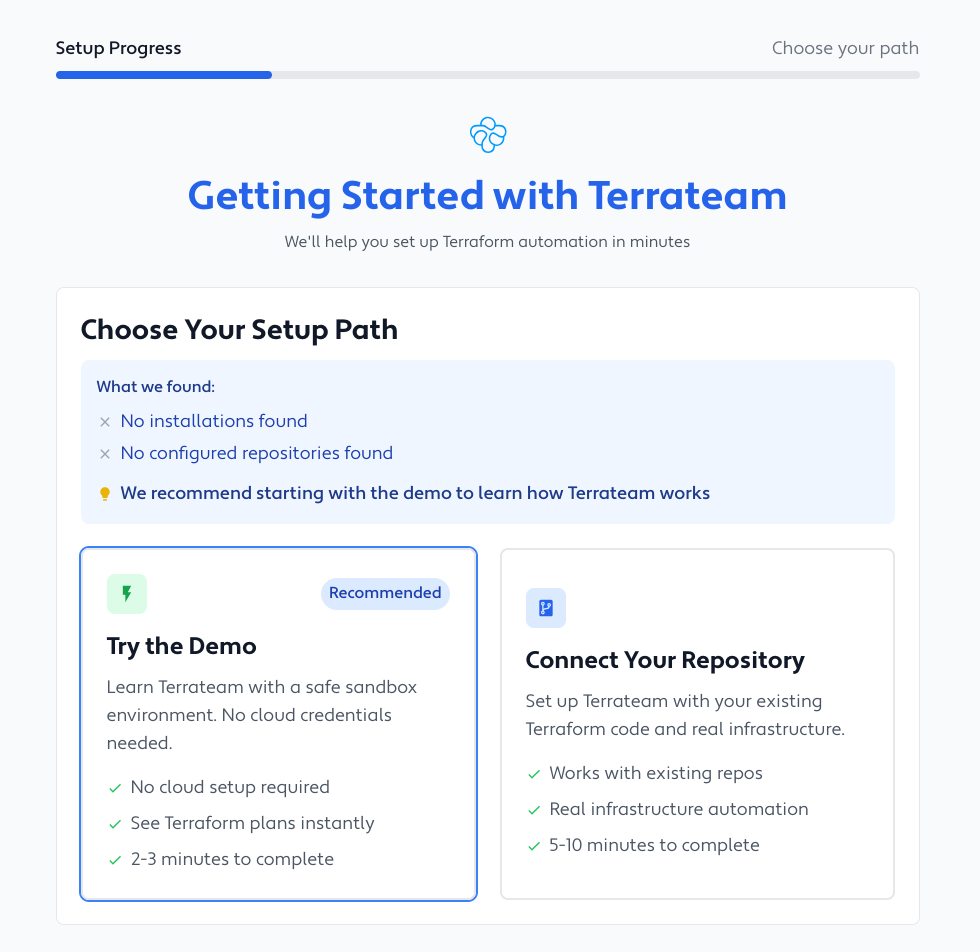

import { LinkCard, CardGrid } from '@astrojs/starlight/components';

## Start Here

<LinkCard
  title="Sign up for Terrateam"
  description="Launch the setup wizard and get running in 2 minutes"
  href="https://terrateam.io/signup"
  target="_blank"
/>

The setup wizard launches automatically after signup and will:
- Assess your current setup
- Recommend the best path (demo or your own repo)
- Guide you through each step with automatic verification
- Get you to your first Terraform plan in minutes

## Choose Your Path

After signing up, you'll see two options:

### Option 1: Try the Demo (Recommended)
**2-3 minutes** • No cloud credentials needed

Perfect for first-time users. Uses simulated infrastructure so you can safely learn Terrateam's workflow.

### Option 2: Connect Your Repository
**5-10 minutes** • For existing Terraform users

Jump straight in with your own Terraform code and real infrastructure.

## What's Next?

After the wizard completes:

1. **Make a change** - Edit any `.tf` file
2. **Open a pull request** - Terrateam automatically runs `terraform plan`
3. **Review and apply** - Comment `terrateam apply` to deploy

## Need Help?

<CardGrid>
  <LinkCard 
    title="Concepts"
    description="Learn how Terrateam works"
    href="/getting-started/concepts"
  />
  <LinkCard 
    title="Commands"
    description="See all available commands"
    href="/command-reference"
  />
</CardGrid>

:::tip
The wizard handles all configuration automatically. Just sign up and follow the prompts!
:::