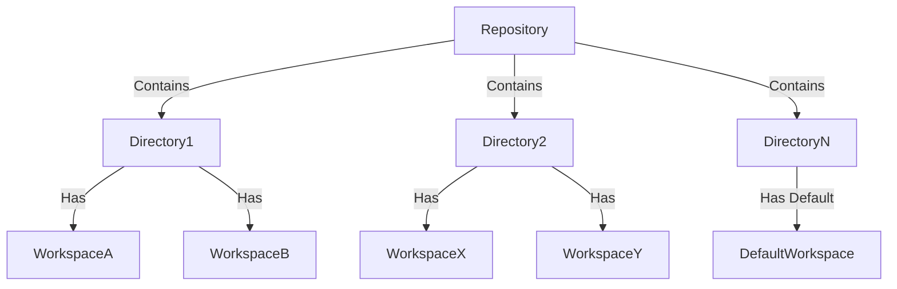
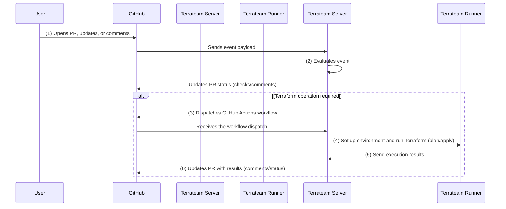

import { Card, CardGrid, LinkCard } from '@astrojs/starlight/components';
import { Steps } from '@astrojs/starlight/components';

Terrateam brings GitOps based infrastructure orchestration to your workflow. It supports Terraform, OpenTofu, Pulumi, CDKTF, and any command line driven tool, giving you full control over how infrastructure changes are executed from pull requests.

## Core Concepts

Before diving into the technical details, it's important to understand some key concepts of Terrateam:

- Terrateam builds upon [Terraform](https://www.terraform.io/), a tool for defining infrastructure using code. If you're new to Terraform, we recommend reviewing their [documentation](https://www.terraform.io/docs) first.
- Terrateam integrates Terraform operations directly into your GitHub pull request workflow, enabling you to plan, review, and apply infrastructure changes through GitHub comments.
- Terrateam automates the execution of Terraform commands based on pull request events, making it easier to manage your infrastructure.
- Terrateam enables team collaboration on infrastructure changes by providing clear visibility into proposed changes and their impacts.

:::note
For additional context about the the concepts behind Terrateam, check the [Concepts](/getting-started/concepts/) page.
:::

## Terrateam Architecture

Terrateam consists of two main components:

<CardGrid>
  <Card title="Terrateam Server" icon="server">
    The server listens for GitHub events and determines the appropriate Terraform operation based on the event payload. It manages Terraform execution and state updates.
  </Card>

  <Card title="Terrateam Runner" icon="running">
    The runner executes Terraform commands in response to instructions from the server. It interacts with your repository and reports the results back to GitHub.
  </Card>
</CardGrid>

## Repositories Hierarchy

Terrateam operates on your Terraform code using the following hierarchy:

- **Repository**: The top-level entity that represents your GitHub repository containing Terraform code.
- **Directory**: A repository can contain zero or more directories, each representing a logical grouping of Terraform resources. Each directory is processed independently.
- **Workspace**: Each directory can have one or more workspaces, allowing you to use the same Terraform code in different contexts (e.g., development, staging, production). If no workspace is specified, each directory has a default workspace.

The following diagram presents the hierarchy Terrateam uses.

This hierarchy enables you to structure your Terraform code in a modular and reusable way, making it easier to manage and maintain your infrastructure.

## Workflow

Here's a high-level overview of how Terrateam works:

The following steps offer a more detailed explanation of each part of the diagram.

<Steps>
1. Event Trigger

   A user performs an action on GitHub, such as opening a pull request, updating it, or commenting on it. This action triggers an event that is sent to the Terrateam server.

2. Event Evaluation

   The Terrateam server evaluates the received event to determine if a Terraform operation needs to be executed. It analyzes the changes in the pull request and decides whether to trigger a plan or apply operation.

3. Workflow Dispatch

   If the server determines that a Terraform operation is required, it dispatches a GitHub Actions workflow to the Terrateam runner. The workflow contains the necessary information and instructions for executing the Terraform commands.

4. Terraform Execution

   The Terrateam runner receives the workflow dispatch and starts executing the Terraform operations. It clones your GitHub repository, sets up the necessary environment, and runs the Terraform commands (e.g., `terraform plan` or `terraform apply`) for each modified directory.

5. Result Reporting

   Once the Terraform execution is complete, the Terrateam runner collects the results and sends them back to the Terrateam server. The results include the output of the Terraform commands, any changes made to the infrastructure, and the overall status of the operation.

6. Feedback and Notifications

   The Terrateam server processes the received results and provides feedback to the user. It adds comments to the pull request with the Terraform plan output, updates status checks, and notifies stakeholders of the operation’s outcome.

</Steps>

## Key Features

Terrateam offers several key features that enhance your Terraform workflow:

<CardGrid>
  <Card title="Plan and Apply Operations" icon="list-check">
    Terrateam allows you to manually trigger Terraform plan and apply operations directly from your pull requests. You can review the proposed changes, collaborate with your team, and apply the changes when ready.
  </Card>
  <Card title="Automatic Plan and Apply" icon="clock">
    Terrateam can automatically trigger plan operations when a pull request is opened or updated, and apply the changes when the pull request is merged. This ensures that your infrastructure stays in sync with your code.
  </Card>
  <Card title="Locking and Concurrency" icon="lock">
    Terrateam implements intelligent locking mechanisms to prevent concurrent modifications to the same resources. It ensures that only one apply operation can be executed at a time for a given directory and workspace, maintaining the integrity of your infrastructure state.
  </Card>
  <Card title="Customizable Workflows" icon="sliders">
    Terrateam allows you to customize your Terraform workflows using a configuration file. You can define custom plan and apply steps, set up notifications, and integrate with other tools and services to tailor Terrateam to your specific needs.
  </Card>
</CardGrid>

## Next Steps
Continue learning about Terrateam on the following pages:

<CardGrid>
  <LinkCard title="Getting started pages" href="/getting-started" />
  <LinkCard title="Terrateam key concepts" href="/getting-started/concepts" />
  <LinkCard title="Configuring your project" href="/getting-started/configuration" />
</CardGrid>
