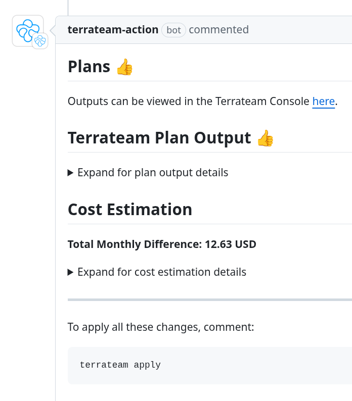

import { Steps } from '@astrojs/starlight/components';
import { LinkCard, CardGrid, Card } from '@astrojs/starlight/components';

## What is Terrateam?

Terrateam is a powerful Terraform and OpenTofu GitOps CI/CD solution that seamlessly integrates with GitHub, enabling teams to deliver infrastructure faster and more efficiently. With Terrateam, you can easily manage your infrastructure as code, collaborate with your team, and automate your deployment processes.

<CardGrid>
	<Card title="Tight GitHub Integrations" icon="github">
		Terrateam is built as a GitHub application and a GitHub Action, allowing you to manage your infrastructure directly from your GitHub repository.
	</Card>
	<Card title="GitOps Workflow" icon="rocket">
		Terraform operations are triggered by pull requests and comments, making it easy to review and approve changes before they are applied.
	</Card>
	<Card title="Secure Authentication" icon="sun">
		Terrateam authenticates with your cloud provider using OIDC, which enhances security and reduces the exposure of user credentials.
	</Card>
	<Card title="Locks and Concurrency" icon="seti:lock">
		When multiple team members are working on the same Terraform project, locks play a crucial role in coordinating their efforts and preventing conflicting changes.
	</Card>
	<Card title="Role-Based Access Control" icon="error">
		With Terrateam, you can define fine-grained access control policies to manage who can perform specific operations on your infrastructure.
	</Card>
	<Card title="Custom Workflows" icon="puzzle">
		Terrateam enables custom Terraform workflows, such as automating Slack notifications post-apply, tailored to your team's needs.
	</Card>
	<Card title="Multiple Environments" icon="star">
		Easily manage multiple environments (e.g., development, staging, production) and multiple cloud providers with Terrateam's powerful configuration options.
	</Card>
	<Card title="Policy Enforcement" icon="document">
		Integrate policy testing with OPA Conftest to ensure your infrastructure changes adhere to best practices and compliance requirements.
	</Card>
</CardGrid>

## Terraform the GitOps Way
<Steps>
1. #### Create a Pull Request

   

1. #### Terrateam will automatically run a Plan operation

   

1. #### Apply your changes *before* or *after* you merge

   

</Steps>

## Why Should I Use Terrateam?
Terrateam provides a comprehensive set of features and best practices to streamline your infrastructure as code workflow, making it easier and safer to manage your Terraform projects.

<CardGrid>
  <Card title="Streamlined workflows" icon="laptop">
    Terrateam takes care of the complex aspects of integrating Terraform with GitHub Actions, providing a seamless and efficient workflow out of the box. With Terrateam, you can focus on writing your Terraform code and let the tool handle the rest.
  </Card>
  <Card title="Get on the same page" icon="approve-check">
    Terrateam enables effective collaboration among team members by providing a pull request-based workflow. Terrateam allows teams to review and discuss proposed changes before applying them. This ensures that everyone is on the same page and reduces the risk of errors and conflicts.
  </Card>
  <Card title="Safety and consistency" icon="star">
    Terrateam incorporates sophisticated tracking mechanisms to store Terraform operational state and ensure the safety and consistency of your infrastructure. It intelligently handles dependencies and locks, preventing concurrent modifications and maintaining a reliable and accurate representation of your infrastructure.
  </Card>
  <Card title="Customized to your needs" icon="rocket">
    Terrateam offers a wide range of configuration options and extensibility points, allowing you to tailor the tool to your specific needs and workflows. You can define custom plan and apply steps, configure notifications and integrations, and leverage Terrateam's powerful features like drift detection, cost estimation, and policy enforcement.
  </Card>
</CardGrid>

## Why Build When You Can Leverage?
Building and maintaining a homegrown Terraform solution can be time-consuming, resource-intensive, and prone to errors. For a safe and effective workflow, you must account for the following:
- Plan file storage and cleanup
- Approval steps between Plan and Apply
- Multiple pull requests with overlapping resources
- Drift Detection and Reconciliation
- Failed Apply operations
- Locks and Unlocks
- Plan and Apply restrictions
- Secure cloud integrations

Terrateam offers a battle-tested, feature-rich, and actively maintained solution that you can leverage out of the box. By adopting Terrateam, you can focus on writing Terraform code and managing your infrastructure, while benefiting from the collective experience and best practices of the Terrateam community.

## Getting Started
To start using Terrateam, follow these simple steps:

<Steps>
1. #### Installation

   Install the Terrateam GitHub application on your repository. See the [Quickstart Guide](/quickstart-guide) for detailed instructions.

2. #### Configuration

   Configure Terrateam using the `.terrateam/config.yml` file in your repository. Check out the [Configuration Reference](/configuration-reference) for more information on the available options.

3. #### Cloud Provider integration

   Set up authentication and authorization for your cloud provider. Terrateam supports various providers, including AWS, GCP, and Azure. See the [Cloud Providers](/cloud-providers) documentation for step-by-step instructions.
</Steps>

## Learn More
- Learn more about [Terrateam Concepts](/getting-started/concepts)
- Dive into the [Configuration Reference](/configuration-reference) for a detailed look at the available options
- Explore [Advanced Workflows](/advanced-workflows) and [Integrations](/integrations) to learn about complex use cases
