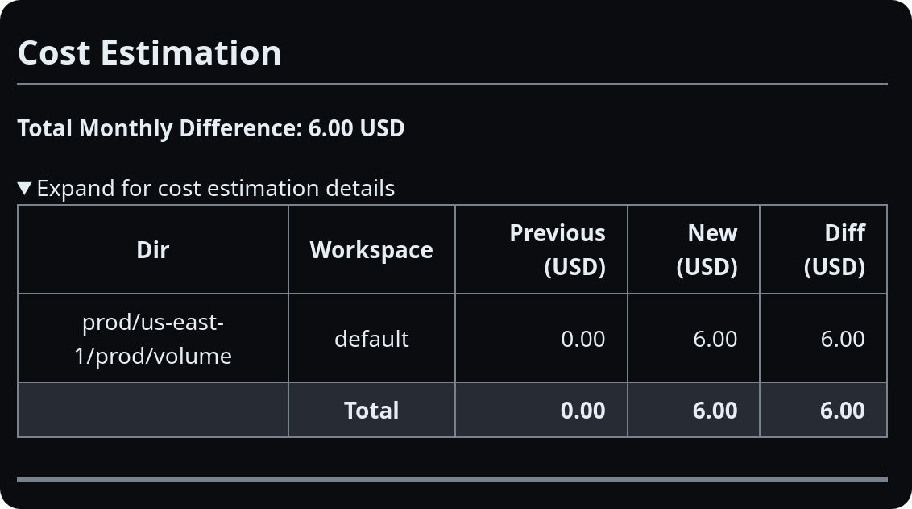

import { Steps } from '@astrojs/starlight/components';

Terrateam's cost estimation feature allows you to automatically estimate the cost impact of your Terraform changes directly in your pull requests. This can help you make informed decisions about your infrastructure changes and avoid unexpected costs.

## Enabling Cost Estimation

Cost estimation is enabled by default in Terrateam. If you want to disable it or customize its behavior, you can do so in your Terrateam configuration file (`.terrateam/config.yml`).
```yaml
cost_estimation:
  enabled: true
  provider: infracost
  currency: USD
```

- `enabled`: Set to `true` to enable Cost Estimation, or `false` to disable it.
- `provider`: Specify the cost estimation provider. Currently, only `infracost` is supported.
- `currency`: Set the currency for the cost estimates. Default is `USD`.

## How It Works

<Steps>
1. Open a pull request with changes to your Terraform code.

1. Terrateam automatically runs a plan operation and generates a cost estimate using the specified provider.

1. Terrateam comments on the pull request with the cost estimate, showing the breakdown of costs and the total cost impact of the changes.

1. Review the cost estimate and collaborate with your team to ensure the changes are within your budget.

1. If necessary, make adjustments to your Terraform code to optimize costs.

1. Once the pull request is approved and changes are applied with Terrateam, the actual costs will be incurred.

</Steps>



## Infracost Integration

Terrateam integrates with [Infracost](https://www.infracost.io/), a cloud cost estimation tool, to provide accurate and detailed cost estimates for your Terraform changes.

### Infracost Cloud

:::note
An Infracost API key is not required for cost estimation to work.
:::

To use [Infracost Cloud](https://www.infracost.io/docs/infracost_cloud/get_started/) with Terrateam, you need to provide an Infracost API key. You can obtain a free API key by signing up on the [Infracost website](https://www.infracost.io/).
Once you have your API key, you can add it as a secret to your GitHub repository:
```bash
gh secret set INFRACOST_API_KEY
```
Terrateam will automatically detect the `INFRACOST_API_KEY` secret and use it to authenticate with the Infracost API.

### Customizing Infracost Behavior

Terrateam supports environment variables that you can use to customize the behavior of Infracost. You can set these environment variables using [hooks](/configuration-reference/hooks), [workflows](/configuration-reference/workflows), or GitHub Secrets.

##### `INFRACOST_CURRENCY`
Set the currency for the cost estimates. This overrides the `currency` setting in your Terrateam configuration file.

##### `INFRACOST_ARGS`
Pass additional arguments to the `infracost` command. For example, you can use `--show-skipped` to include resources that were skipped in the cost estimate.

## Viewing Cost Estimates

When Terrateam generates a cost estimate for a pull request, it will add a comment to the pull request with the following information:
- A summary of the cost impact, showing the total monthly cost change.
- A breakdown of the costs by resource type and individual resources.

You can review the cost estimate directly in the pull request and discuss it with your team using GitHub's commenting features.

## Considerations

- Cost estimation is based on the Terraform plan and does not reflect the actual costs incurred. The actual costs may vary depending on factors such as usage patterns and pricing changes.
- Infracost supports a wide range of cloud providers and resources, but there may be some resources that are not yet supported. In such cases, the cost estimate may be incomplete.
- Cost estimation adds some overhead to the Terrateam plan operation, as it needs to generate the cost estimate in addition to the regular Terraform plan. However, this overhead is usually minimal and should not significantly impact your workflow.
