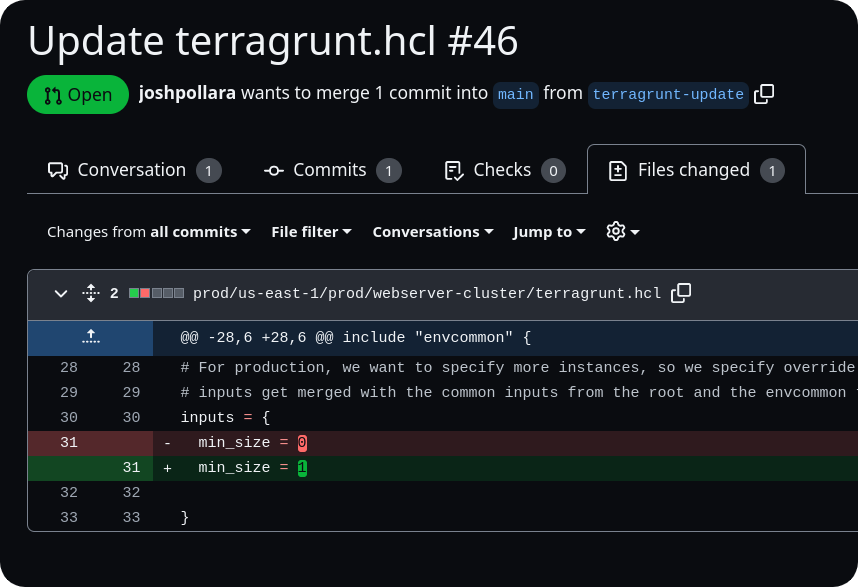
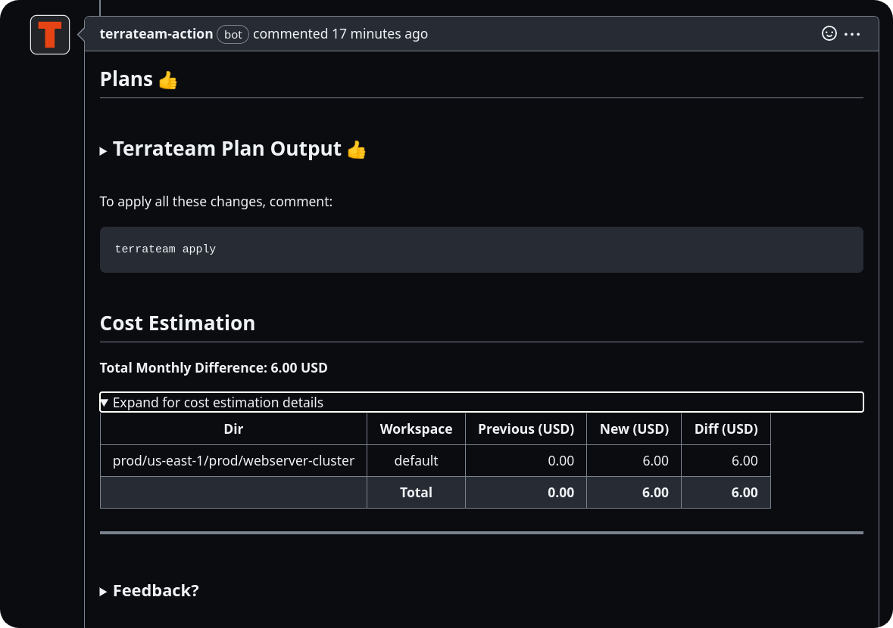

import { Steps } from '@astrojs/starlight/components';

[Terragrunt](https://terragrunt.gruntwork.io/) is a thin wrapper that provides extra tools for keeping your Terraform configurations DRY, working with multiple Terraform modules, and managing remote state. Terrateam seamlessly integrates with Terragrunt, allowing you to leverage its features while still benefiting from Terrateam's collaboration and automation capabilities.

## Enabling Terragrunt

To use Terragrunt with Terrateam, you need to configure Terrateam to use the Terragrunt CLI instead of the default Terraform CLI. You can do this by specifying the [engine](/configuration-reference/engine) in your Terrateam configuration file (`.terrateam/config.yml`).

Here's an example configuration that sets Terragrunt as the default engine with a specific version and triggers Terrateam operations when any `terragrunt.hcl` file is modified, except for the root `terragrunt.hcl`:
```yaml
engine:
  name: terragrunt
  version: 0.69.3
dirs:
  "**/terragrunt.hcl":
    when_modified:
      file_patterns: ['${DIR}/terragrunt.hcl']
  '.':
    when_modified:
      file_patterns: []
```

Alternatively, you can specify the engine in the `workflows` section of your configuration file:
```yaml
dirs:
  "**/terragrunt.hcl":
    when_modified:
      file_patterns: ['${DIR}/terragrunt.hcl']
  '.':
    when_modified:
      file_patterns: []
workflows:
  - tag_query: ""
    engine:
      name: terragrunt
```

With this configuration, Terrateam will replace the `terraform` command with `terragrunt` in all plan and apply workflows.

## Example Repository

Gruntwork maintains an [infrastructure-live](https://github.com/gruntwork-io/terragrunt-infrastructure-live-example) repository that demonstrates how to use Terragrunt with a real-world project structure. You can use this repository as a starting point for your own Terragrunt setup with Terrateam.

## Modules

The `infrastructure-live` example repository pulls modules from the `terragrunt-infrastructure-modules-example` repository found [here](https://github.com/gruntwork-io/terragrunt-infrastructure-modules-example). See the [envcommon](https://github.com/gruntwork-io/terragrunt-infrastructure-live-example/tree/master/_envcommon) `terragrunt.hcl` files for the `base_source_url` definitions.
You can continue to use this repository, but it's recommended to mirror the repository into your GitHub organization and reference the new URL in your `base_source_url` definitions.
:::note
The Terrateam GitHub application must be installed on module repositories for Terrateam to successfully clone the repository during plan and apply operations.
:::

## Making Changes

With your `infrastructure-live` repository set up and configured for Terragrunt and Terrateam, you can start making changes and creating pull requests.


Terrateam will automatically detect changes to your `terragrunt.hcl` files and trigger the appropriate plan and apply operations based on your configuration.

## Best Practices

- Keep your Terragrunt configurations modular and reusable, leveraging the features provided by Terragrunt to reduce duplication and simplify management.
- Use a consistent naming convention for your `terragrunt.hcl` files and directory structure to make it easy to navigate and understand your infrastructure setup.
- Ensure that the Terrateam GitHub application is installed on any repositories containing Terraform modules referenced by your Terragrunt configurations.
