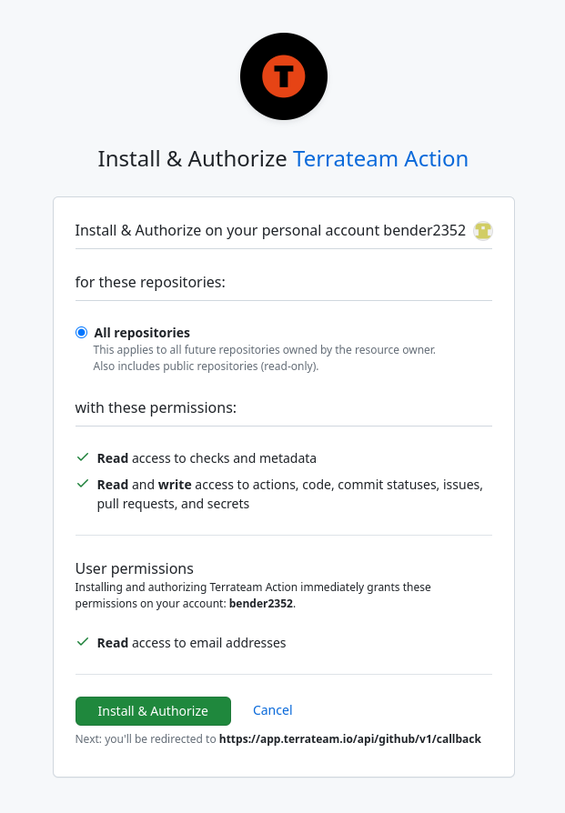
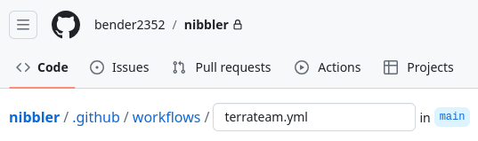
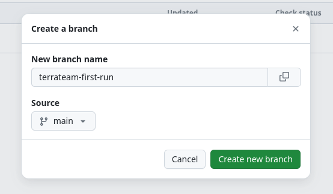
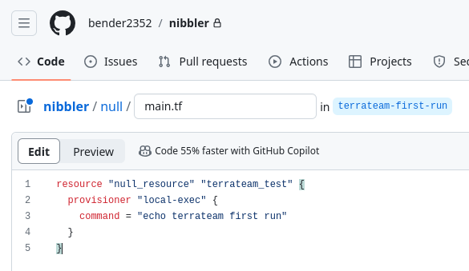
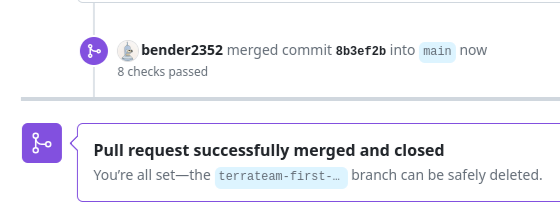

import { Steps } from '@astrojs/starlight/components';
import { Icon } from '@astrojs/starlight/components';
import { LinkCard, CardGrid, Card } from '@astrojs/starlight/components';

Welcome to the Terrateam Quickstart guide! This guide will help you set up Terrateam, integrate it with GitHub, and run your first Terraform deployment—all in a few simple steps. 

## Prerequisites

Before getting started with Terrateam, make sure you have the following:

- **A GitHub repository** with Terraform code
- **GitHub Actions** enabled in your repository
- **Administrator access** to install the Terrateam GitHub app
- **Cloud provider credentials** *(Required for production deployments, but optional for this guide.)*

## Demo Repository

Want to follow along with a working example? You can fork our [Terrateam example repository](https://github.com/terrateam-demo/kick-the-tires) to practice with pre-configured Terraform code.

<LinkCard
  title="Terrateam Example Repository"
  href="https://github.com/terrateam-demo/kick-the-tires"
  icon="github"
/>

## Setting Up Terrateam

Terrateam bridges GitHub's pull request workflow with Terraform operations, automating the plan/apply process while maintaining safety controls.

<Steps>
1. **Install the Terrateam GitHub Application**

   Sign up for a Terrateam account and install the GitHub app in your organization.
   
   - $149/mo unlimited with a 14-day free trial (no credit card required)
   - Select the GitHub organizations and repositories containing your Terraform code.
   
   <LinkCard
     title="Sign up for Terrateam"
     href="https://terrateam.io/signup"
   />
   
   

2. **Add the Terrateam GitHub Actions Workflow**

   The workflow file enables Terrateam to run Terraform operations within your GitHub Actions environment.
   
   - Create a `.github/workflows` directory in your repository if it doesn't exist.
   - Download and add the [terrateam.yml](https://raw.githubusercontent.com/terrateamio/terrateam-example/main/.github/actions/workflows/default/terrateam.yml) file to this directory.
   - Commit the file to your default branch (`main` or `master`).
   
   
   
   :::note
   This workflow file is essential as it allows Terrateam to execute Terraform commands in response to pull request events.
   :::

3. **Configure Cloud Provider Authentication (Optional for this guide)**

   You'll need to set up authentication with your cloud provider for real infrastructure deployments.
   
   <LinkCard
     title="Cloud Provider Setup"
     href="/cloud-providers"
     description="Configure AWS, GCP, Azure or other providers"
   />
</Steps>

## Your First Terrateam Deployment

Let's test Terrateam with a simple example that doesn't require cloud provider credentials.

:::tip[What is a `null_resource`?]
The [`null_resource`](https://registry.terraform.io/providers/hashicorp/null/latest/docs/resources/resource) in Terraform is like a placeholder, it doesn’t create real cloud resources but can still run commands, It’s perfect for testing workflows.
:::

<Steps>
1. **Create a New Branch**

   Create a branch to make your changes.
   
   

2. **Add Terraform Code**

   Create a file called `main.tf` with the following code:
   
   ```hcl
    resource "null_resource" "terrateam_test" {
    provisioner "local-exec" {
        command = "echo terrateam first run"
      }
    }
   ```
   
   
   
   You can also [download the sample code](https://raw.githubusercontent.com/terrateamio/terrateam-example/main/main.tf).

3. **Create a Pull Request**

   Commit and push your changes, then create a pull request.
   
   

4. **Watch the Automatic Terraform Plan**

   Terrateam automatically triggers a `terraform plan` when a pull request contains Terraform code changes.
   
   
   
   This plan is a preview of what will happen when you apply the changes.

5. **Apply the Changes**

   Comment `terrateam apply` on the pull request to execute the changes.
   
   
   
   Terrateam will run `terraform apply` based on the previously generated plan.

6. **Merge Your Changes**

   Once applied, you can merge the pull request to incorporate the changes into your main branch.
   
   
   
   :::tip[Apply after merge]
   In production workflows, you might want to apply changes only after merging.
   [Learn about apply-after-merge workflows](/advanced-workflows/apply-after-merge)
   :::
</Steps>

## Congratulations!

You've successfully completed your first Terrateam deployment! This demonstrates the core GitOps workflow that Terrateam enables:

1. Make infrastructure changes in a branch
2. Create a pull request
3. Review the automatically generated plan
4. Apply changes through simple comments
5. Merge the approved changes
