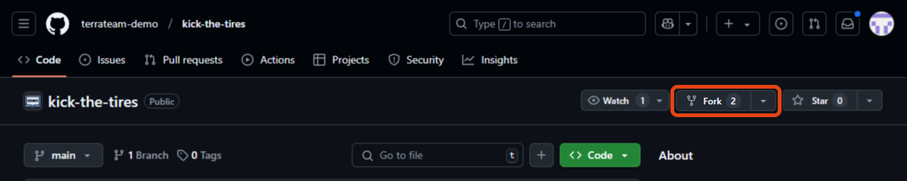
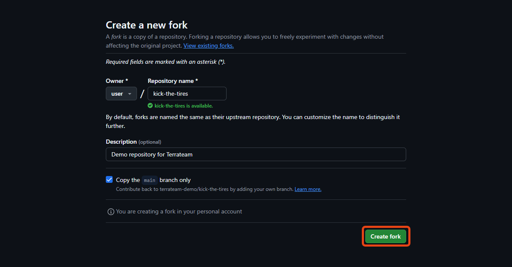
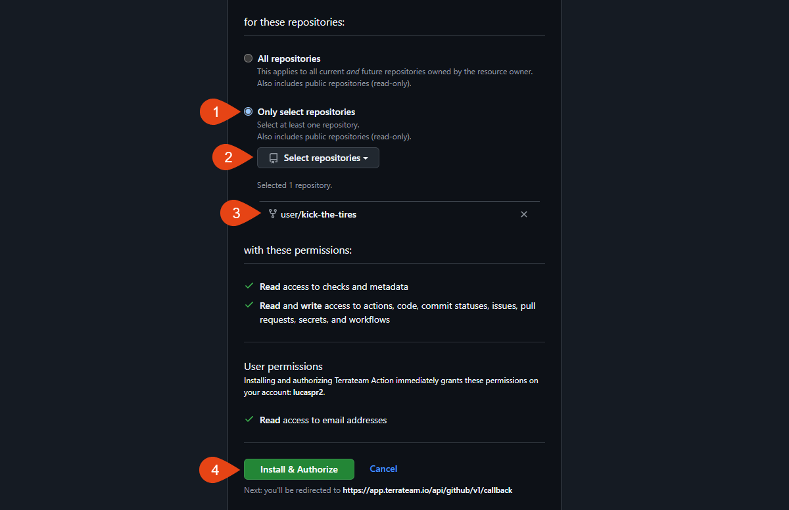

import { Steps } from '@astrojs/starlight/components';
import { Icon } from '@astrojs/starlight/components';
import { LinkCard, CardGrid, Card } from '@astrojs/starlight/components';

The following steps on this page will help you to set up Terrateam, integrate it with GitHub, and run your first Terraform deployment in just a few steps.

## Prerequisites

Before getting started with Terrateam quickstart guide, make sure you have the following:

- **A GitHub account** to fork Terrateam [demo repository](https://github.com/terrateam-demo/kick-the-tires).
- **GitHub Actions** enabled in your forked repository.
- **Administrator access** to install the Terrateam GitHub app.


## Demo Repository Workflow

The easiest way to get started is using our ready-to-use demo repository with pre-configured Terraform code. Follow these steps to quickly test Terrateam's capabilities.

<LinkCard
  title="Terrateam Demo Repository"
  href="https://github.com/terrateam-demo/kick-the-tires"
  icon="github"
/>

<Steps>
1. **Fork the Demo Repository**

   Click the link above to access our demo repository, then click the "Fork" button in the top-right corner of the page.
   
   
   
   On the "Create a new fork" screen, keep the default settings and click "Create fork".
   
   
   
   :::note
   Make sure you've already signed up for Terrateam and installed the GitHub application before continuing.
   <LinkCard
     title="Install Terrateam GitHub App"
     href="https://github.com/apps/terrateam-action"
   />
   :::

2. **Install the Terrateam GitHub Application (if you haven't already)**

   Sign up for a Terrateam account and install the GitHub app in your organization.
   
   - $149/mo unlimited with a 14-day free trial (no credit card required)
   - Select the GitHub organizations and repositories containing your Terraform code.
   
   <LinkCard
     title="Sign up for Terrateam"
     href="https://terrateam.io/signup"
   />
   
   After installation, go to [your Terrateam dashboard](https://app.terrateam.io/). Your forked repository should appear there.
   


3. **Clone Your Forked Repository**

   Clone the repository to your local machine and navigate to its directory:
   
   ```bash
   git clone https://github.com/your-username/kick-the-tires.git
   cd kick-the-tires
   ```
   :::note
   replace `your-username` with your GitHub username.
   :::
   
4. **Create a New Branch**

   Create a branch to make your changes:
   
   ```bash
   git checkout -b test-branch
   ```
   
5. **Modify a Terraform File**

   Let's modify a file to test the workflow. Open `staging/compute/main.tf` and change the instance name.
   
   For example, find a line like:
   
   ```hcl {5}
   module "staging_compute_instance" {
   source = "../../modules/compute"

   instance_count = 0
   instance_name  = "staging-instance"
   instance_zone  = "us-central1-a"
   boot_disk_image = "debian-cloud/debian-11"
   network_name    = "default"
   }
   ```
   
   Change the `instance_name` to something like:
   
   ```hcl {5}
   module "staging_compute_instance" {
   source = "../../modules/compute"

   instance_count = 0
   instance_name  = "staging-instance-modified"
   instance_zone  = "us-central1-a"
   boot_disk_image = "debian-cloud/debian-11"
   network_name    = "default"
   }
   ```
   
6. **Commit and Push Your Changes**

   Commit your changes and push them to your branch:
   
   ```bash
   git add .
   git commit -m "Testing Terrateam workflow"
   git push origin test-branch
   ```
   

7. **Create a Pull Request**

   Go to your forked repository on GitHub. You should see a prompt to create a pull request for your recently pushed branch.
   
   
   :::warning
   Important: Make sure to change the base repository to your fork instead of creating a PR on the original Terrateam repository. The base should be your `main` branch, and the compare should be your `test-branch`.
   :::
   
   
   
   :::caution
   Ensure that workflows are enabled on your forked repository. If GitHub Actions workflows are disabled, you'll need to enable them in the repository settings.
   :::

8. **Watch the Automatic Terraform Plan**

   Once the pull request is created, Terrateam will automatically trigger a `terraform plan`. This plan will appear as a comment on your pull request, showing what changes would be made.
   
   
   
   This plan is a preview of what will happen when you apply the changes.

9. **Apply the Changes**

   To execute the changes, comment `terrateam apply` on the pull request.
   
   
  After you add the comment, the Terrateam app will run the `terraform apply` command. This will apply the previous plan to the Terraform file, updating your infrastructure.

10. **Merge Your Changes**

    Once applied and everything looks good, you can merge the pull request to incorporate the changes into your main branch.
    
</Steps>


You've successfully completed your first Terrateam deployment using the demo repository. 

1. Make infrastructure changes in a branch
2. Create a pull request
3. Review the automatically generated plan
4. Apply changes through simple comments
5. Merge the approved changes