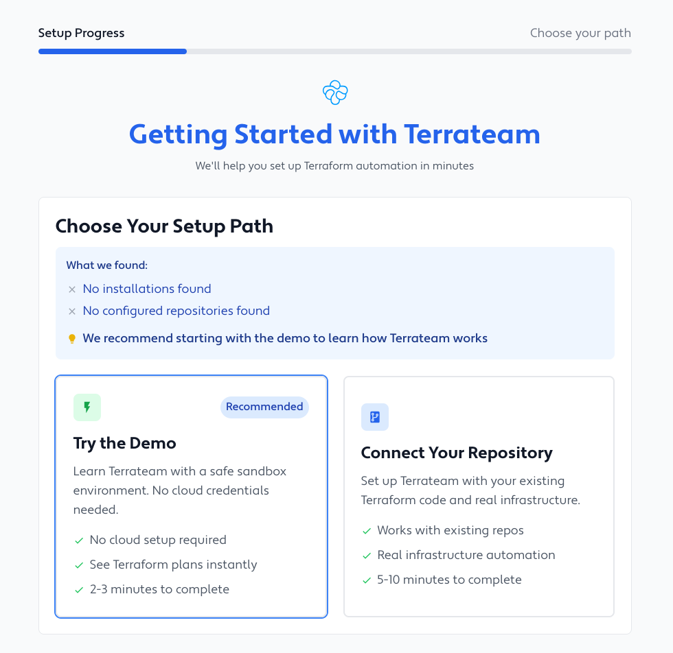
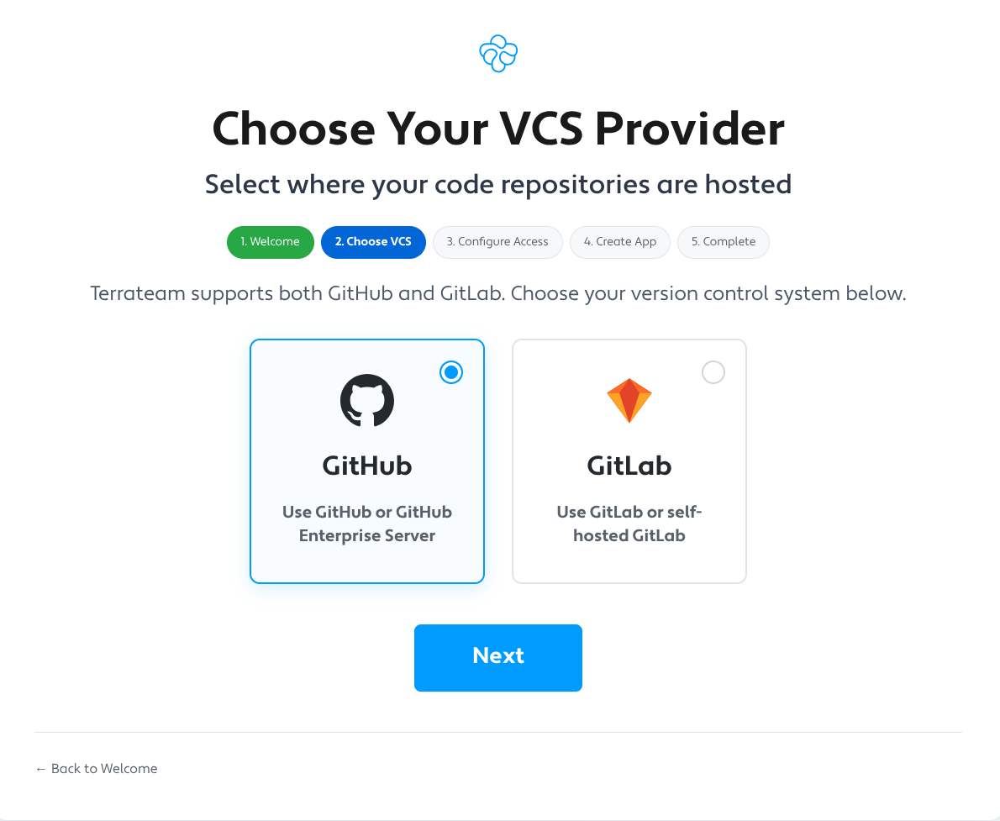

import { LinkCard, CardGrid, Card } from '@astrojs/starlight/components';

## Choose Your Deployment Path

Get started with Terrateam in the way that works best for your team:

<CardGrid>
  <LinkCard 
    title="☁️ Terrateam Cloud" 
    description="Fastest setup • 2 minutes • Fully managed service • Free tier available"
    href="https://terrateam.io/signup"
    target="_blank"
  />
  
  <LinkCard 
    title="🏢 Self-Hosted" 
    description="Full control • 10-30 minutes • Your infrastructure • Complete data sovereignty"
    href="#-self-hosted-deployment"
  />
</CardGrid>

---

## ☁️ Terrateam Cloud

The fastest way to start using Terrateam. Perfect for teams who want to focus on Terraform, not infrastructure.

:::tip[Ready to start?]
<LinkCard
  title="Sign up for Terrateam Cloud"
  description="Launch the setup wizard and get running in 2 minutes"
  href="https://terrateam.io/signup"
  target="_blank"
/>
:::

### How It Works

1. **Sign up** at [terrateam.io/signup](https://terrateam.io/signup)
2. **Choose your path** in the setup wizard:
   - **Demo Repository** (2-3 minutes) - Learn with simulated infrastructure
   - **Your Repository** (5-10 minutes) - Connect your existing Terraform code

[](https://terrateam.io/signup)

3. **Create your first pull request** - Terrateam automatically runs `terraform plan` on every PR

---

## 🏢 Self-Hosted Deployment

Deploy Terrateam in your own environment for complete control and data sovereignty.

### Choose Your Deployment Method

<CardGrid stacked>
  <LinkCard
    title="🐳 Docker Compose"
    description="Quick setup with automated wizard • Perfect for development and small teams • 10-15 minutes"
    href="/self-hosted/docker-compose"
  />
  <LinkCard
    title="☸️ Kubernetes / Helm"
    description="Production-ready with high availability • Ideal for enterprise deployments • 20-30 minutes"
    href="/self-hosted/kubernetes"
  />
</CardGrid>

### Quick Start with Docker

Get running quickly with our automated setup wizard:

```sh
# Clone the repository
git clone https://github.com/stategraph/stategraph.git
cd terrateam/docker/terrat

# Start the setup wizard
docker-compose up setup

# Open http://localhost:3000 and follow the wizard
```

The setup wizard guides you through the entire process:



The wizard automatically:
- Creates your GitHub App or configures GitLab integration
- Generates all credentials and keys
- Configures webhooks and permissions
- Validates your entire setup

---

## What's Next?

After the wizard completes:

1. **Make a change** - Edit any `.tf` file
2. **Open a pull request** - Terrateam automatically runs `terraform plan`
3. **Review and apply** - Comment `terrateam apply` to deploy
