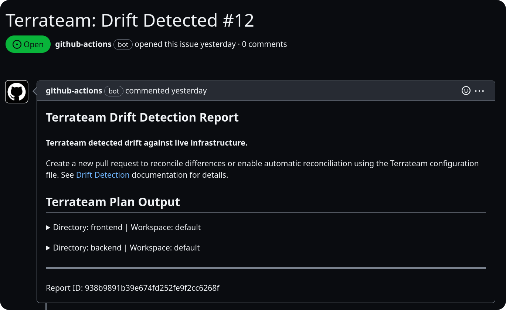

The `drift` configuration can be used to control drift detection and reconciliation schedules in a repository.

## Default Configuration
```yaml
drift:
  enabled: false
  schedules: {}
```

## Keys
| Key | Type | Description |
|-----|------|-------------|
| enabled | Boolean | Specifies whether drift detection is enabled. If set to false, drift detection and reconciliation will not run. Default is false. |
| schedules | Object | An object where the key is the unique name of the schedule and the value is the configuration for the schedule. |

:::note
More than one schedule is a SaaS (all plans) and Enterprise Edition feature.
:::

### Schedule
| Key | Type | Description |
|-----|------|-------------|
| schedule | String | The interval to run drift detection and reconciliation: `hourly`, `daily`, `weekly`, `monthly`. |
| branch | String | The branch where the drift run executes. Optional. If omitted, Terrateam uses the repository default branch. |
| reconcile | Boolean | Specifies whether reconciliation is enabled. Default is false. |
| tag_query | String | A tag query that specifies which directories and workspaces drift detection and reconciliation should be applied to. |
| window | Object | The window that the scheduled drift can run in. Optional. |

The `schedule` defines how frequently drift can run.  There is no guarantee that drift will run as frequently as specified or when it will run.  In practice, this is only relevant for `hourly`, as a drift run might take longer than an hour to run.

### Window
| Key | Type | Description |
|-----|------|-------------|
| start | String | The start of the window, inclusive, in the form `HH:MM TZ`.  Hour should be in 24-hour notation. |
| end | String | The end of the window, exclusive, in the form `HH:MM TZ`.  Hour should be in 24-hour notation. |

For a list of valid timezone abbreviations, see [here](https://en.wikipedia.org/wiki/List_of_time_zone_abbreviations).

:::note
If `end` is less than `start`, it is interpreted as crossing over to the next day.  For example if `start` is `21:00 EST` and `end` is `01:00 EST`, the window wills start at `21:00 EST` today and end at `01:00 EST` tomorrow.
:::


## Examples
### Enabling Drift Detection
```yaml
drift:
  enabled: true
  schedules:
    default:
      tag_query: ''
      schedule: daily
```
This configuration will enable drift detection and run it on a daily schedule.

### Enabling Drift Detection with Reconciliation
```yaml
drift:
  enabled: true
  schedules:
    default:
      tag_query: ''
      schedule: weekly
      reconcile: true
```
This configuration will enable drift detection with automatic reconciliation and run it on a weekly schedule.

### Using Tag Queries to Limit Scope
```yaml
drift:
  enabled: true
  schedules:
    prod:
      tag_query: 'dir:production'
      schedule: hourly
```
This configuration will enable drift detection, run it on an hourly schedule, and limit it to to the `dir:production` [tag query](/advanced-workflows/tags).

### Running Drift on a Non-Default Branch
```yaml
drift:
  enabled: true
  schedules:
    staging:
      branch: release/staging
      tag_query: 'dir:staging'
      schedule: daily
```
This configuration stores the schedule from the default branch config, but runs drift using the code and Terrateam config from `release/staging`.

The Terrateam CI workflow file must exist on the target branch. If the target branch is deleted or cannot be found when the schedule fires, Terrateam skips that run.

If `branch` is omitted, Terrateam follows the repository default branch. Setting `branch` to the current default branch name is an explicit pin; if the repository default branch is renamed later, that schedule continues to target the old branch name until the config is changed.

## Schedule
The `schedule` key can be set to one of the following values:
- `hourly`
- `daily`
- `weekly`
- `monthly`
:::info
There is no default value for `schedule`, and this key is required when drift detection is enabled.
:::

### Enable drift for production after work hours and development any time
```yaml
drift:
  enabled: true
  schedules:
    prod:
      tag_query: 'dir:production'
      schedule: daily
      window:
        start: '18:00 EST'
        end: '07:00 EST'
    dev:
      tag_query: 'dir:dev'
      schedule: daily
```
This configuration runs drift daily for both production and development environments, however the production window is limited to after 6pm to 7am the next day.

## Reconciliation
The `reconcile` key enables or disables automatic reconciliation. When enabled, if changes are found during drift detection, an apply operation will automatically run against the generated Terraform plan to reconcile the infrastructure state.

:::caution
Reconciliation is allowed on non-default branches. Use it carefully when multiple branch schedules cover the same dirspaces, because those branches can apply competing desired states to the same infrastructure.
:::

## Configuration Source
Drift schedules are read and stored only from the default branch Terrateam config. Each run executes against the schedule's target branch and fetches that branch's Terrateam config, merged with system defaults. Default-branch override keys still come from the default branch according to `default_branch_overrides`.

Changing `drift.enabled` on a target branch does not add, remove, or skip stored schedules. To change which schedules exist, update the default branch config.

Drift unlocks are repository-scoped and unlock drift runs for all branches in the repository.

## Notifications
### GitHub Issues
If changes are found during drift detection, a GitHub Issue can be automatically created by adding the following configuration:
```yaml
hooks:
  plan:
    post:
      - type: drift_create_issue
```
Duplicate issues for identical changes will not be created.


#### Grouping
By default a single issue is opened that lists every drifted dirspace. To open one issue per drifted dirspace instead, set `group_by: dirspace`:
```yaml
hooks:
  plan:
    post:
      - type: drift_create_issue
        group_by: dirspace
```
This is useful when different dirspaces are owned by different teams or need to be triaged, assigned, and closed independently. Each per-dirspace issue is titled `Terrateam: Drift Detected - <dir> (<workspace>)` and is deduplicated independently — re-running drift will not re-open an issue whose plan output is unchanged.

| Value | Behavior |
|-------|----------|
| `all` (default) | One aggregated issue per drift run, listing every drifted dirspace. |
| `dirspace` | One issue per drifted dirspace. |

### Slack
You can create Slack notifications using the official [GitHub Integration for Slack](https://github.com/integrations/slack):
- Install the app in your desired Slack workspace and channel.
- Use the `/github` command to subscribe to your Terraform repository:
   ```
   /github subscribe owner/repo issues
   ```

### Custom Notifications
To create custom notifications or actions when drift detection finds changes, you can implement a custom hook:
```yaml
hooks:
  plan:
    post:
      - type: run # run drift-notify.sh on every drift run with changes
        cmd: ['bash', '-c', '$TERRATEAM_ROOT/drift-notify.sh']
```

`drift-notify.sh`:
```bash
#!/usr/bin/env bash
set -e
if [[ "$TERRATEAM_RUN_KIND" == "drift" ]] && [[ -f "$TERRATEAM_RESULTS_FILE" ]]; then
  echo "This is a drift operation"
fi
```

## Considerations
When configuring drift detection, keep the following in mind:

- When a drift schedule is created or updated, it is immediately run.
- Drift detection operations are equivalent to plan operations. Existing [workflows](/reference/configuration/workflows) and [hooks](/reference/configuration/hooks) run for all drift detection operations.
- The following environment variable is defined for plan and apply operations initiated by drift detection: `TERRATEAM_RUN_KIND=drift`
- If reconciliation is enabled, changes will be automatically applied without manual review or approval. Ensure that you have appropriate safeguards and testing in place before enabling automatic reconciliation.
- Drift detection can generate a significant number of GitHub Issues if changes are frequently detected. Consider using appropriate filters, such as the `tag_query` key, to limit the scope of drift detection and reduce noise.
- Custom notifications and actions can be implemented using hooks and scripts to integrate drift detection with your existing monitoring and alerting systems.
