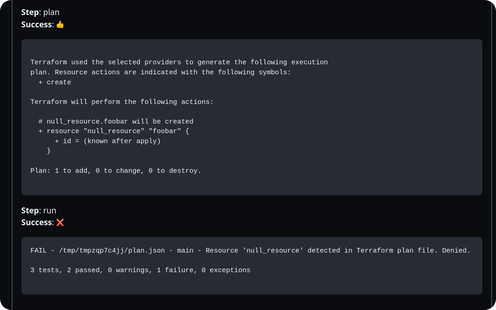

import { Steps } from '@astrojs/starlight/components';

Terrateam integrates with Open Policy Agent (OPA) and Conftest to provide powerful policy enforcement capabilities for your Terraform plans. By defining custom policies using the Rego query language, you can ensure that your Terraform configurations adhere to your organization's standards, best practices, and compliance requirements.

## What is Open Policy Agent (OPA)?

[Open Policy Agent (OPA)](https://www.openpolicyagent.org/) is an open-source, general-purpose policy engine that enables unified policy enforcement across the stack. OPA provides a declarative language called Rego for defining policies and a runtime for evaluating those policies against structured data, such as JSON or YAML.

## What is Conftest?

[Conftest](https://www.conftest.dev/) is a utility that helps you write tests against structured configuration data, such as Terraform plans, Kubernetes manifests, or Serverless configurations. Conftest uses OPA's Rego language to define policies and provides a command-line interface for testing your configurations against those policies.

## Configuring Policy Enforcement

To enable policy enforcement with OPA and Conftest in Terrateam, you need to configure a custom workflow in your Terrateam configuration file (`.terrateam/config.yml`).

Here's an example configuration that runs Conftest against the generated Terraform plan:
```yaml
workflows:
  - tag_query: ''
    plan:
      - type: init
      - type: plan
      - type: run
        cmd: ['conftest-wrapper']
        capture_output: true
```

In this configuration:
- The `init` and `plan` steps generate the Terraform plan as usual.
- The `run` step executes the `conftest-wrapper` script, which calls the `conftest` binary with the generated Terraform plan file.
- The `capture_output` option is set to `true` to include the Conftest output in the Terrateam plan results.

:::note
The `conftest-wrapper` is a simple bash script that calls the `conftest` binary using the generated Terraform plan file. You can find the source code [here](https://github.com/terrateamio/action/blob/main/conftest-wrapper).
:::

## Defining Policies with Rego

Conftest policies are written using the [Rego](https://www.openpolicyagent.org/docs/latest/policy-language/) query language. Rego allows you to define rules and constraints that your Terraform configurations must satisfy.

Here's an example Rego policy that denies the creation of any resources using the `null_resource` provider:
```
package main
resource_types = {"null_resource"}
resources[resource_type] = all {
    some resource_type
    resource_types[resource_type]
    all := [name |
        name:= input.resource_changes[_]
        name.type == resource_type
    ]
}
num_creates[resource_type] = num {
    some resource_type
    resource_types[resource_type]
    all := resources[resource_type]
    creates := [res |  res:= all[_]; res.change.actions[_] == "create"]
    num := count(creates)
}
deny[msg] {
    num_resources := num_creates["null_resource"]
    num_resources > 0
    msg := "Resource 'null_resource' detected in Terraform plan file. Denied."
}
```

This policy defines a `deny` rule that generates an error message if the Terraform plan contains any `null_resource` creations.

## Policy Directory Structure

By default, Conftest looks for Rego policy files in the `policy` directory relative to the directory being processed by Terrateam.

For example, if a pull request contains a change for the file `foo/bar/main.tf`, Conftest will look for Rego policy files in the `foo/bar/policy/` directory.
```bash
foo
└── bar
    ├── main.tf
    └── policy
└── main.rego

```
You can customize the policy directory by setting the `CONFTEST_POLICY` environment variable in your Terrateam workflow configuration.

## Example with Custom Options

Conftest provides various configuration options that can be set using environment variables. You can find the full list of options [here](https://www.conftest.dev/options/).

Here's an example of how to specify a different policy directory using the `CONFTEST_POLICY` environment variable in your Terrateam workflow:
```yaml
workflows:
  - tag_query: 'dir:aws/us-east-1/production/iam'
    plan:
      - type: init
      - type: plan
      - type: env
        name: CONFTEST_POLICY
        cmd: ['echo', '$TERRATEAM_ROOT/aws/policies/iam/']
      - type: run
        cmd: ['conftest-wrapper']
        capture_output: true 
```

In this configuration:
- The `env` step sets the `CONFTEST_POLICY` environment variable to the `aws/policies/iam/` directory relative to the repository root (`$TERRATEAM_ROOT`).
- The `run` step executes the `conftest-wrapper` script, which will use the specified policy directory when running Conftest.
With this setup, when a pull request is created against the `aws/us-east-1/production/iam/main.tf` file, Terrateam will execute Conftest using the Rego policy files located in the `aws/policies/iam/` directory.

## Policy Testing Workflow

When a Terrateam plan operation runs with policy enforcement enabled, the following workflow takes place:
<Steps>
1. Terrateam generates the Terraform plan file.

1. Conftest is executed against the generated plan file using the specified Rego policies.

1. If the plan violates any of the defined policies, Conftest returns a non-zero exit status, causing the Terrateam plan operation to fail.

1. The Conftest output, including any policy violations, is captured and included in the Terrateam plan results.

1. If the plan passes all policy checks, the Terrateam plan operation succeeds, and the plan can be reviewed and applied as usual.
</Steps>



## Best Practices

When implementing policy enforcement with OPA and Conftest in Terrateam, consider the following best practices:
- Define clear and concise policies that align with your organization's standards, best practices, and compliance requirements.
- Use meaningful error messages in your Rego policies to help users understand why a plan failed and how to remediate the issues.
- Organize your policies in a logical directory structure that reflects your infrastructure and makes it easy to manage and maintain the policies.
