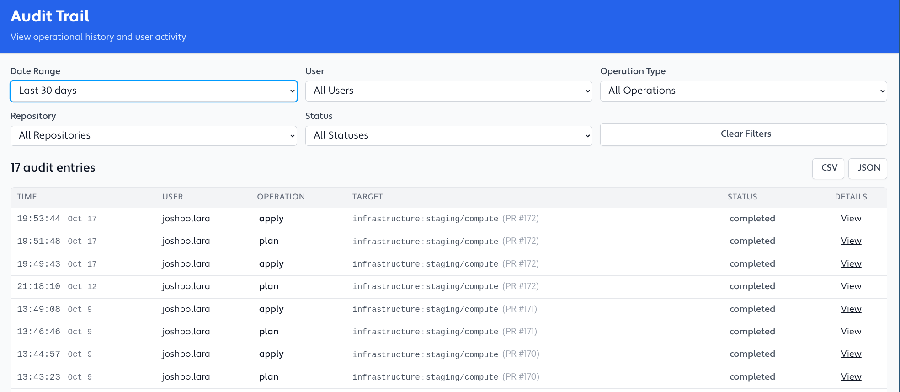

import { Steps } from '@astrojs/starlight/components';

Terrateam's audit trail feature provides a comprehensive view of all the operations executed by Terrateam in your repository. With audit trail, you can easily track and analyze the history of your infrastructure changes, making it a valuable tool for auditing, compliance, and troubleshooting purposes.

## Accessing Audit Trail

To access the audit trail, follow these steps:
<Steps>
1. Log in to the [Terrateam Console](https://app.terrateam.io/).

1. Navigate to the `Audit trail` tab.

1. Use the provided query interface to filter and search through the operation history.
</Steps>

## Querying Audit Trail

Terrateam leverages its powerful [tag query language](/advanced-workflows/tags) to provide a flexible and intuitive way to query the audit trail. You can use various criteria to filter the operation history, such as date range, user, workspace, directory, and more.

### Query Syntax

The audit trail query syntax follows the same structure as the tag query language. You can use the following operators and keywords to construct your queries:
##### `and`
Combines multiple conditions that must all be true.

##### `or`
Combines multiple conditions where at least one must be true.

##### `not`
Negates a condition.

##### `..`
Defines a range of values (e.g., for date ranges).

##### `<key>:<value>`
Matches a specific key-value pair.

### Example Queries

Here are some example queries to help you get started with audit trail:
##### `created_at:2023-11-01..2023-12-01`
Retrieves all runs from November 1st, 2023, to November 30th, 2023 (inclusive).

##### `created_at:2023-11-01..2023-12-01 and user:joe`
Retrieves all runs from November 1st, 2023, to November 30th, 2023 (inclusive), executed by the user "joe".

##### `created_at:2023-11-01..2023-12-01 and user:joe and (dir:envs/prod/s3 or dir:envs/prod/iam)`
Retrieves all runs from November 1st, 2023, to November 30th, 2023 (inclusive), executed by the user "joe", where the directories "envs/prod/s3" or "envs/prod/iam" were affected.

## Audit Trail Data

The audit trail feature captures and stores various details about each Terrateam operation, including:
- Timestamp: The date and time when the operation was executed.
- User: The user who triggered the operation.
- Operation Type: The type of operation (e.g., plan, apply, destroy).
- Directories: The directories affected by the operation.
- Status: The status of the operation (e.g., success, failure).
- Output: The output generated by the operation, including any logs or error messages.

With this data, you can gain valuable insights into your infrastructure changes, identify potential issues, and ensure compliance with your organization's policies and procedures.

## Benefits Of Audit Trail

Audit trail provides several key benefits for managing your infrastructure as code with Terrateam:
- Accountability: Track who made changes to your infrastructure and when, ensuring accountability and transparency.
- Compliance: Demonstrate compliance with internal policies and external regulations by maintaining a detailed record of all infrastructure changes.
- Troubleshooting: Quickly identify and investigate issues by searching through the operation history and analyzing the associated data.
- Insights: Gain valuable insights into your infrastructure change patterns, identify bottlenecks, and optimize your workflows based on historical data.

## Learn More

To learn more about how Terrateam implemented the audit trail feature, check out our blog post: [Ocaml to PostgreSQL: Building Dynamic Queries with Type Safety](https://terrateam.io/blog/ocaml-to-postgresql-audit-trail).
