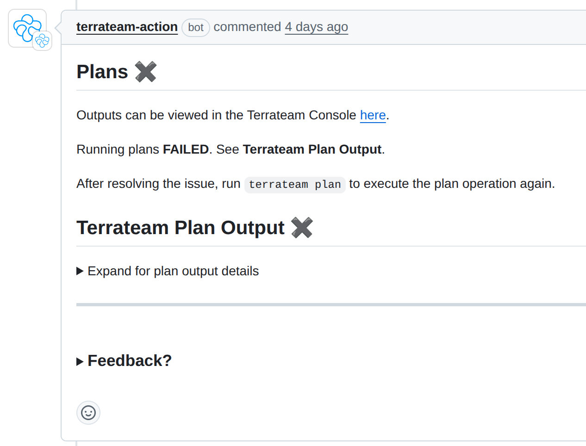

= Handling Old Comments
:authors: Marcos Benevides
:state: committed
:labels: configuration,comments,database,design,github,gitlab,pull_requests,ui,vcs
:source-highlighter: highlight.js
:toc:
ifdef::env-github[]
:tip-caption: :bulb:
:note-caption: :information_source:
:important-caption: :heavy_exclamation_mark:
:caution-caption: :fire:
:warning-caption: :warning:
endif::[]

== Status

In Discussion.

== Goals

. Document how comments work as of now.
. Aggregate community suggestions.
. Describe possible implementations of https://github.com/terrateamio/terrateam/issues/116[terrateamio/terrateam#116].
. Discuss trade-offs of each alternative.

== Background

Currently, the Terrateam application posts comments in response to specific user events (triggered by commands such as `terrateam plan`, `terrateam apply`) on pull requests.

. Application comments are not currently tracked or stored in our systems; we rely solely on GitHub/GitLab as the source of truth.
. There are ways for a change with multiple directories to cause comment sprawl over a pull request.
. We are still unsure on how to relate comments with `work_manifests`.
. There used to be a mechanism to deal with oversized comments, but it seems to be disabled now.
. We have no mechanisms to group related comments together nor can we provide a consolidated summary.

____
For context, here are some customer scenarios:

. Multi-directory PRs: Teams with 10+ directories get overwhelming comment sprawl
. Review confusion: Multiple reviewers can't find the latest relevant information
. Error visibility: Failed directories get buried in comment noise
. Mobile experience: Long comment threads are unusable on mobile devices
____

=== Community Suggestions

The community has raised multiple suggestions around improving comment handling, mostly to reduce noise on pull requests. Some suggestions include:

. Allowing comments to be minimized, outdated, or deleted to reduce noise while preserving a clear audit trail.
. Anchoring a single comment that is updated over time, rather than posting multiple new comments for each operation.
. Introducing a _"status/summary"_ comment that acts as a consolidated view of all operations on a PR, reducing fragmentation of information and making it easier for reviewers to assess the state of infrastructure changes.

  📊 Terrateam Summary: 2 failed, 8 succeeded, 3 no changes
  🔴 Failed: prod/iam, staging/compute
  🟢 Succeeded: prod/databases, prod/networking...
  📊 View Full Dashboard →

== Dependencies

This section describes each services/modules that are going to be affected by this feature.

=== GitHub API

Our only supported VCS as of now.

=== GitLab API

Since https://github.com/terrateamio/terrateam/issues/150[#150] got merged, GitLab support is now live.

=== PostgreSQL

Currently, we do not store comment data in PostgreSQL. To implement any of the suggested solutions we would have to at least store:

. The Comment ID and its PR number.
. The kind of strategy being used.
. Track when a comment is part of a larger output that got broken in smaller chunks.

as for now we have the following tables tracking:

* `github_pull_requests`

[source,sql]
----
terrateam=> \d github_pull_requests
                   Table "public.github_pull_requests"
   Column    |           Type           | Collation | Nullable | Default 
-------------+--------------------------+-----------+----------+---------
 base_branch | text                     |           | not null | 
 base_sha    | text                     |           | not null | 
 branch      | text                     |           | not null | 
 pull_number | bigint                   |           | not null | 
 repository  | bigint                   |           | not null | 
 sha         | text                     |           | not null | 
 state       | text                     |           | not null | 
 merged_sha  | text                     |           |          | 
 merged_at   | timestamp with time zone |           |          | 
 title       | text                     |           |          | 
 username    | text                     |           |          | 
----

* `github_pull_requests_map`

[source,sql]
----
terrateam=> \d github_pull_requests_map
              Table "public.github_pull_requests_map"
    Column     |  Type  | Collation | Nullable |      Default      
---------------+--------+-----------+----------+-------------------
 repository_id | bigint |           | not null | 
 pull_number   | bigint |           | not null | 
 core_id       | uuid   |           | not null | gen_random_uuid()
----

* `work_manifests`
[source,sql]
----
terrateam=> \d work_manifests
                           Table "public.work_manifests"
    Column    |           Type           | Collation | Nullable |      Default      
--------------+--------------------------+-----------+----------+-------------------
 base_sha     | text                     |           | not null | 
 completed_at | timestamp with time zone |           |          | 
 created_at   | timestamp with time zone |           | not null | now()
 id           | uuid                     |           | not null | gen_random_uuid()
 run_id       | text                     |           |          | 
 run_type     | text                     |           | not null | 
 sha          | text                     |           | not null | 
 state        | text                     |           | not null | 'queued'::text
 tag_query    | text                     |           | not null | 
 username     | text                     |           |          | 
 dirspaces    | jsonb                    |           |          | 
 run_kind     | text                     |           | not null | 
 environment  | text                     |           |          | 
 runs_on      | jsonb                    |           |          | 
 repo         | uuid                     |           | not null | 
 pull_request | uuid                     |           |          | 
----

=== Terrateam Changes

. Configuration
.. Given that our aim to make the most configurable IaC tool ever, we need to embed a new set of configurations and default values.
.. Focus on making it per-directory so people can have freedom to apply different commenting rules.

. Codebase
.. Issue https://github.com/terrateamio/terrateam/issues/561[#561] and PR https://github.com/terrateamio/terrateam/pull/562[#562] aim to add a comment library that implements VCS-agnostic operations.

== Proposals

Our proposal is to allow users to select different strategies and give then options to apply them separetely, as this will cover a large amount of use cases.

=== Strategies for Comment Handling

Append (Current Behavior) :: Append a new comment for each operation
* Pros: Simplest one to implement, audit-friendly.
* Cons: Leads to PR clutter and makes status tracking harder.

Minimize (or Mark Comments as Outdated) :: Use GitHub’s API to mark earlier comments as outdated.
* Pros: Reduces visible clutter, users can still fix data if something bad happens.
* Cons: Can be confusing if related issues are obscured, also you can have output that spans many many comments, then you'll have tons of "outdated" comments in your PR. This means your PR could just be lines of "outdated" boxes. That isn't really something under our control, of course, but it can lead to clutter.

Delete :: Remove previous comments entirely once new ones are posted.
* Pros: Cleanest PR view.
* Cons: Loss of historical context, users can't manually fix stuff if something bad happens.

TODO: Discouse about what to do about deleted `apply` comments

Update (Re-use Comments) :: Link comments to a specific directory (dirspace) via metadata in the work_manifest, and update them in-place.
* Pros: Clean UI, less noisy. Once inplemented, summaries are just a corollary of updates.
* Cons: Requires properly tracking comment IDs to `work_manifests`. Hardest one to implement.

NOTE: The update strategy was initially considered, but due the its complexity, its only being partially described in this RFD.

Besides the following 4 strategies, there are some extra properties to consider:

* Once a comment is posted as a `plan`/`apply`, no matter the comment strategy, it *should not* be replaced/deleted by the output of an opposite command (i.e. a "plan" output cannot be updated in-place to an "apply").

* We always keep the latest `plan`/`apply` of a particular _dispace_.
* An addendum of the previous property, the output of a `plan`/`apply` from a dirspace `A` should not change the output of a `plan`/`apply` from a dirspace `B`.
* Also, we keep the latest `plan`/`apply` until all of its contents have been re-generated. Other comments are handled accordinly by the selected strategy.
* We always reserve a little bit of space to update older comments (to provide admonitions).
* Keep the error message around until it's no longer needed (TODO: properly describe conditions later).

==== Terrateam Configuration

The following is a proposal of how that would look like as a top level key:

[source,yaml]
----
# Default configuration that solves 80% of customer pain
# TODO: `notifications` is a temporary name, still looking for somethig better.
notifications:
  policies:
    # Default configuration
    - tag_query: ""
      # append, delete, minimize
      comment_strategy: minimize

    # Extra suggested options (for a future RFD)
    - tag_query: ""
      group_id: "A"
      # append, delete, minimize
      comment_strategy: minimize
      # enabled, disabled
      commit_status: "disabled"
----

===== Primitives

Every `update_strategy` will obey a certain set of primitive operations under certain limitations, _L_ represents a limit of how much content we can put in a single comment (different platforms have different limits) and _El_ corresponds to the actual content of an output (like plan/apply results, dirspaces changes, metadata, etc).

TIP: For GitHub, _L_ is currently set to https://github.com/mshick/add-pr-comment/issues/93#issuecomment-1531415467[65586 characters] or something like https://github.com/mshick/add-pr-comment/issues/93#issuecomment-1532775191[~200 kb], for GitLab it's 1Mb.
TODO: Add links supporting GitLabs limits as well.

These operations will work independent of the chosen strategy:

Compact Large Single Outputs :: How to proceed if an element is larger than the VCS limit (_L_).

Given an element _El_ whose `rendered_length` is greater than _L_, do the following:

. Run the `compact` function, whose implementation varies depending on the VCS.
. Our output is a smaller version of the original _El_, named _El'_.

The main goal behind this is not to deal with the complications of VCS limits and just redirect people to the UI, where we can give users better reports. 

Group Outputs :: Given a list of elements (name _Els_), we proceed to do the following rules:

[source,text]
----
L = 512
Els = [ 
  { dirpace: "A/A", rendered_length: 128, is_success: false, strategy: Append},
  { dirpace: "B/B", rendered_length: 248, is_success: false, strategy: Append},
  { dirpace: "C/C", rendered_length: 2048, is_success: false, strategy: Minimize},
  { dirpace: "D/D", rendered_length: 128, is_success: true, strategy: Minimize},
  { dirpace: "E/E", rendered_length: 128, is_success: false, strategy: Minimize},
  { dirpace: "F/F", rendered_length: 1024, is_success: false, strategy: Delete},
  { dirpace: "G/G", rendered_length: 384, is_success: true, strategy: Append}
]
----

. Run compact in all individual elements _El_ that exceed _L_.

[source,text]
----
Els = [ 
  { dirpace: "A/A", rendered_length: 128, is_success: false, strategy: Append},
  { dirpace: "B/B", rendered_length: 248, is_success: false, strategy: Append},
  { dirpace: "C/C", rendered_length: 248, is_success: false, strategy: Minimize}, <-- Changed
  { dirpace: "D/D", rendered_length: 128, is_success: true, strategy: Minimize},
  { dirpace: "E/E", rendered_length: 128, is_success: false, strategy: Minimize},
  { dirpace: "F/F", rendered_length: 248, is_success: false, strategy: Delete}, <-- Changed
  { dirpace: "G/G", rendered_length: 384, is_success: true, strategy: Append}
]
----

. Partition the previous list by strategy, grouping alls elements that have the same strategy on the same groups (_G_), we can have up to three such groups, give that we plan to support only three strategies for now.
 
[source,text]
----
G = {
  Append: [
    { dirpace: "A/A", rendered_length: 128, is_success: false, strategy: Append},
    { dirpace: "B/B", rendered_length: 248, is_success: false, strategy: Append},
    { dirpace: "G/G", rendered_length: 384, is_success: true, strategy: Append}
  ],
  Minimize: [
    { dirpace: "C/C", rendered_length: 248, is_success: false, strategy: Minimize},
    { dirpace: "D/D", rendered_length: 128, is_success: true, strategy: Minimize},
    { dirpace: "E/E", rendered_length: 128, is_success: false, strategy: Minimize}
  ],
  Delete: [
    { dirpace: "F/F", rendered_length: 248, is_success: false, strategy: Delete}
  ]
}
----

. Sort each subgroup by (`is_success`, `dirspace`), where `false > true`.

[source,text]
----
G = {
  Append: [
    { dirpace: "A/A", rendered_length: 128, is_success: false, strategy: Append},
    { dirpace: "B/B", rendered_length: 248, is_success: false, strategy: Append},
    { dirpace: "G/G", rendered_length: 384, is_success: true, strategy: Append}
  ],
  Minimize: [
    { dirpace: "C/C", rendered_length: 248, is_success: false, strategy: Minimize},
    { dirpace: "E/E", rendered_length: 128, is_success: false, strategy: Minimize}
    { dirpace: "D/D", rendered_length: 128, is_success: true, strategy: Minimize},
  ],
  Delete: [
    { dirpace: "F/F", rendered_length: 248, is_success: false, strategy: Delete}
  ]
}
----

. Split each subgroup in a smaller subgroup when the combined `rendered_length` of elements is greater than _L_.

[source,text]
----
G = {
  Append: [
    [
      { dirpace: "A/A", rendered_length: 128, is_success: false, strategy: Append},
      { dirpace: "B/B", rendered_length: 248, is_success: false, strategy: Append},
    ],
    [ 
      { dirpace: "G/G", rendered_length: 384, is_success: true, strategy: Append}
    ]
  ],
  Minimize: [
    [
      { dirpace: "C/C", rendered_length: 248, is_success: false, strategy: Minimize},
      { dirpace: "E/E", rendered_length: 128, is_success: false, strategy: Minimize}
    ],
    [
      { dirpace: "D/D", rendered_length: 128, is_success: true, strategy: Minimize},
    ]
  ],
  Delete: [
    [
      { dirpace: "F/F", rendered_length: 248, is_success: false, strategy: Delete}
    ]
  ]
}
----

Each grouped (and combined) sub-subgroup becomes it's own comment and will obey their respective strategies, whose semantics is described in the next section.

===== Strategy Semantics

The following are scenarios that will drive the implementation of each strategy.

Scenario 0 :: User creates a pull request for some dirspaces and proceeds to re-run an operation (plan/apply) on all dirspaces. All outputs fit in a single comment.

* Append
** Terrateam publishes a new Github comment with the new output
** Old comment stays untouched in the Pull Request

* Delete
** Terrateam publishes a new Github comment with the new output
** Old comment gets deleted

* Minimize
** Terrateam publishes a new Github comment with the new output
** Old comment gets hidden/minimized (marked as outdated)

* Update
** Terrateam patches the old Github comment with the new content

Scenario 1 :: User creates a pull request for some dirspaces and proceeds to re-run an operation (plan/apply) on a subset of the dirspaces. All outputs fit in a single comment.

* Append
** Terrateam publishes a new Github comment with the new output (from the subset of dirspaces)
** Old comments stay untouched in the Pull Request

* Delete
** Terrateam publishes a new Github comment with that keeps the output from the dirspaces not in the subset, and updates the results of the dirspaces that are in the subset.
** Old comment gets deleted

* Minimize
** Terrateam publishes a new Github comment with that keeps the output from the dirspaces not in the subset, and updates the results of the dirspaces that are in the subset.
** Old comments get hidden/minimized (marked as outdated)

* Update
** Terrateam patches the old comment with all the latest outputs.

Scenario 2 :: User creates a pull request for some dirspaces and proceeds to re-run an operation (plan/apply) on all dirspaces. Combined output is larger than a single comment, but individually they fit in a single comment.

* Append
** Terrateam publishes one or more new Github comments with the new outputs
** Old comments stay untouched in the Pull Request

* Delete
** Terrateam publishes one or more new Github comments with the new outputs
** Old comments get deleted

* Minimize
** Terrateam publishes one or more new Github comments with the new outputs
** Old comments get hidden/minimized (marked as outdated)

Scenario 3 :: User creates a pull request for some dirspaces and proceeds to re-run an operation (plan/apply) on a subset of the dirspaces. Combined output is larger than a single comment, but individually they fit in a single comment.

* Append
** Terrateam publishes new Github comments with the new outputs (from the subset of dirspaces)
** Old comments stay untouched in the Pull Request

* Delete
** Terrateam publishes new Github comments with that keeps the output from the dirspaces not in the subset, and updates the results of the dirspaces that are in the subset.
** Old comments get deleted

* Minimize
** Terrateam publishes new Github comments with that keeps the output from the dirspaces not in the subset, and updates the results of the dirspaces that are in the subset.
** Old comments get hidden/minimized (marked as outdated)

Scenario 4 :: User had a previously working PR, but pushes a commit containing configuration errors

* Append
** Terrateam publishes new Github comments with the error
** Old comments stay untouched in the Pull Request

* Delete
** Terrateam publishes new Github comments with the error
** Old comments get deleted

* Minimize
** Terrateam publishes new Github comments with the error
** Old comments get hidden/minimized (marked as outdated)

Scenario 5 :: A previous comment is an configuration error message, user pushes a commit that fixes it

* Append
** Terrateam publishes new Github comments with new output
** Old comments stay untouched in the Pull Request

* Delete
** Terrateam publishes new Github comments with the error
** Terrateam deletes all but the last error comment

* Minimize
** Terrateam publishes new Github comments with the error
** Old comments get hidden/minimized (marked as outdated)

Scenario 6 :: A user starts with an upgrade strategy A, and then modifies configuration to use strategy B

* Pick all dirspaces inside all comments
* Re-run `plan`/`apply` for the dirspaces again

Scenario 7 :: User run "terrateam plan A B", then proceeds to run "terrateam plan B C"

* Append
** Terrateam publishes new Github comments with the new outputs (from the subset of dirspaces)
** Old comments stay untouched in the Pull Request

* Delete
** Terrateam publishes new Github comments with the error
** Terrateam deletes all but the last error comment

* Minimize
** Terrateam publishes new Github comments with the error
** Old comments get hidden/minimized (marked as outdated)

Scenario 8 :: User runs "terrateam plan A", then proceeds to run "terrateam plan B"

* Append
** Terrateam publishes comment with the plan output of A, and then publishes another comment with the plan output of B.
** Old comments stay untouched in the Pull Request.

* Delete
** Terrateam publishes comment with the combined output of plans A & B.
** Terrateam deletes old plan comments for dirspaces A & B.

* Minimize
** Terrateam publishes comment with the combined output of plans A & B.
** Terrateam marks old plan comments for dirspaces A & B as outdated.

Scenario 9 :: User makes no terrateam changes, but run multiple "terrateam plan" commands.

* Append
** Terrateam publishes a new comment that describes there are no changes.
** Old comments stay untouched in the Pull Request.

* Delete
** Terrateam publishes a new comment that describes there are no changes.
** Old comments get deleted by Terrateam.

* Minimize
** Terrateam publishes a new comment that describes there are no changes.
** Terrateam marks old plan comments as outdated.

Scenario 10 :: User plans and applies Layer 1, and the plans and applies Layer 2

* Append
** Terrateam publishes different outputs for Layers 1 & 2.
** Old comments stay untouched in the Pull Request.

* Delete
** Terrateam publishes different outputs for Layers 1 & 2.
** Old comments (not related to Layers 1 & 2) get deleted by Terrateam.

* Minimize
** Terrateam publishes different outputs for Layers 1 & 2.
** Old comments (not related to Layers 1 & 2) get marked as outdated.

Scenario 11 :: User plans layer 1 through n, then proceeds to commit changes that re-runs all layers

* Append
** Terrateam publishes different outputs for Layers 1 through n.
** Old comments stay untouched in the Pull Request.

* Delete
** Terrateam publishes different outputs for Layers 1 through n, outputs for previous runs get replaced by their respective new values for each dirspace.
** Old comments get deleted by Terrateam.

* Minimize
** Terrateam publishes different outputs for Layers 1 through n, outputs for previous runs get replaced by their respective new values for each dirspace.
** Old comments get marked as outdated.

Scenario 12 :: User has a plan that requires gatekeeper approvals, then performs an apply without a gatekeeper's approval and receives a gatekeeper error message, then gets an approval and later performs a successful apply.

* Append
** Terrateam publishes comment with the plan output of A, then a `gatekeeper` error comment, followed by a succesfull apply comment.
** Old comments stay untouched in the Pull Request.

* Delete
** Terrateam publishes comment with the plan output of A, then a `gatekeeper` error comment, followed by a succesfull apply comment.
** Old comments get deleted by Terrateam.

* Minimize
** Terrateam publishes comment with the plan output of A, then a `gatekeeper` error comment, followed by a succesfull apply comment.
** Old comments get marked as outdated.

=== Storage

First, we must have a way to:

. Store and link comments to repos and pull requests.
. Store output metadata, like configuration errors or dirspace infomation.
. Differentiate between a comment that comes from `work_manifests`, `apply_requirements` and `gatekeeper` errors or generic errors in general.
. Support all prevously described primitives and properly hold their required ids.

==== Tables

This is merely a suggestion on how we can organize our schema, a proposed initial solution is defined in the link:schema.sql[schema.sql file].

link: https://google.com[Google]

.Strategies
|===
|id|name

|1
|append

|2
|minimize

|3
|delete

|===

.Element Type
|===
|id|name

|1
|plan

|2
|apply

|3
|config_error

|4
|custom_step_error

|===

.Element Source
|===
|id|name

|1
|work_manifest

|2
|apply_requirement

|3
|gatekeeper

|===

.Element Status
|===
|id|name

|1
|success

|2
|failure

|===

.GitHub Element
|===
|id| type (FK) | status (FK) | rendered_length | strategy (FK) | source (FK) | dirspace (FK) | comment_id (FK)

|1
|1
|1
|256
|2
|1
|"dir1/workspace1"
|1000

|2
|1
|2
|128
|1
|1
|"dir2/workspace2"
|1000

|3
|3
|2
|128
|1
|2
|NULL
|1001

|===

.Github Comment
|===
|comment_id |repo (FK) |pull_request (FK)

|1000
|100099
|9999

|1001
|100099
|9999

|===

