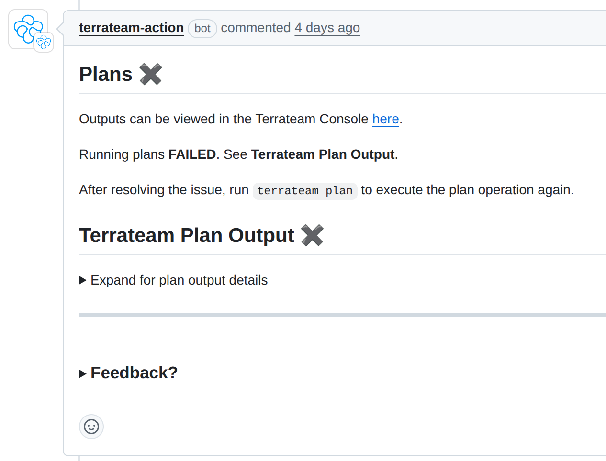

= Handling Old Comments
:authors: Marcos Benevides
:state: ideation
:labels: database,github,pull_requests
:source-highlighter: highlight.js
:toc:
ifdef::env-github[]
:tip-caption: :bulb:
:note-caption: :information_source:
:important-caption: :heavy_exclamation_mark:
:caution-caption: :fire:
:warning-caption: :warning:
endif::[]

== Status

Ideation.

== Goals

. Document how comments work as of now.
. Aggregate community suggestions.
. Describe possible implementations of https://github.com/terrateamio/terrateam/issues/116[terrateamio/terrateam#116].
. Discuss trade-offs of each alternative.

== Background

Currently, the Terrateam application posts comments in response to specific user events (triggered by commands such as `terrateam plan`, `terrateam apply`) on pull requests.

. Application comments are not currently tracked or stored in our systems; we rely solely on GitHub/GitLab as the source of truth.
. There are ways for a change with multiple directories to cause comment sprawl over a pull request.
. We are still unsure on how to relate comments with `work_manifests`
. There used to be a mechanism to deal with oversized comments, but it seems to be disabled now.
. We have no mechanisms to group related comments together nor can we provide a consolidated summary.

____
For context, here are some customer scenarios:

. Multi-directory PRs: Teams with 10+ directories get overwhelming comment sprawl
. Review confusion: Multiple reviewers can't find the latest relevant information
. Error visibility: Failed directories get buried in comment noise
. Mobile experience: Long comment threads are unusable on mobile devices
____

=== Community Suggestions

The community has raised multiple suggestions around improving comment handling, mostly to reduce noise on pull requests. Some suggestions include:

. Allowing comments to be minimized, outdated, or deleted to reduce noise while preserving a clear audit trail.
. Anchoring a single comment that is updated over time, rather than posting multiple new comments for each operation.
. Introducing a _"status/summary"_ comment that acts as a consolidated view of all operations on a PR, reducing fragmentation of information and making it easier for reviewers to assess the state of infrastructure changes.

  📊 Terrateam Summary: 2 failed, 8 succeeded, 3 no changes
  🔴 Failed: prod/iam, staging/compute
  🟢 Succeeded: prod/databases, prod/networking...
  📊 View Full Dashboard →

== Dependencies

This section describes each services/modules that are going to be affected by this feature.

=== GitHub API

Our only supported VCS as of now.

=== GitLab API

TODO We are working on supporting GitLab and should investigate how to accomplish this there as well.

=== PostgreSQL

Currently, we do not store comment data in PostgreSQL. To implement any of the suggested solutions we would have to at least store:

. The Comment ID and its PR number.
. The status of a comment (e.g., active, superseded, minimized).
. Track the generation/version of a comment to maintain its modificatio history.

as for now we have the following tables tracking:

* `github_pull_requests`

[source,sql]
----
terrateam=> \d github_pull_requests
                   Table "public.github_pull_requests"
   Column    |           Type           | Collation | Nullable | Default 
-------------+--------------------------+-----------+----------+---------
 base_branch | text                     |           | not null | 
 base_sha    | text                     |           | not null | 
 branch      | text                     |           | not null | 
 pull_number | bigint                   |           | not null | 
 repository  | bigint                   |           | not null | 
 sha         | text                     |           | not null | 
 state       | text                     |           | not null | 
 merged_sha  | text                     |           |          | 
 merged_at   | timestamp with time zone |           |          | 
 title       | text                     |           |          | 
 username    | text                     |           |          | 
----

* `github_pull_requests_map`

[source,sql]
----
terrateam=> \d github_pull_requests_map
              Table "public.github_pull_requests_map"
    Column     |  Type  | Collation | Nullable |      Default      
---------------+--------+-----------+----------+-------------------
 repository_id | bigint |           | not null | 
 pull_number   | bigint |           | not null | 
 core_id       | uuid   |           | not null | gen_random_uuid()
----

=== Terrateam Configuration

. Given that our aim to make the most configurable IaC tool ever, we need to embed a new set of configurations and default values.
. Focus on making it per-directory so people can have freedom to apply different commenting rules.

== Proposals

Our proposal is to allow users to select different strategies and give then options to apply them separetely, as this will cover a large amount of use cases.

=== Strategies for Comment Handling

Append (Current Behavior) :: Append a new comment for each operation
* Pros: Simplest one to implement, audit-friendly.
* Cons: Leads to PR clutter and makes status tracking harder.

Minimize (or Mark Comments as Outdated) :: Use GitHub’s API to mark earlier comments as outdated.
* Pros: Reduces visible clutter, users can still fix data if something bad happens.
* Cons: Can be confusing if related issues are obscured, also you can have output that spans many many comments, then you'll have tons of "outdated" comments in your PR. This means your PR could just be lines of "outdated" boxes. That isn't really something under our control, of course, but it can lead to clutter.

Delete :: Remove previous comments entirely once new ones are posted.
* Pros: Cleanest PR view.
* Cons: Loss of historical context, users can't manually fix stuff if something bad happens.

TODO: Discouse about what to do about deleted `apply` comments

Update (Re-use Comments) :: Link comments to a specific directory (dirspace) via metadata in the work_manifest, and update them in-place.
* Pros: Clean UI, less noisy. Once inplemented, summaries are just a corollary of updates.
* Cons: Requires properly tracking comment IDs to `work_manifests`. Hardest one to implement.

NOTE: The update strategy was considered, but due the its complexity, its only being partially described in this RFD.

Besides the following 4 strategies, there are some extra points to consider:

* Once a comment is posted as a `plan`/`apply`, no matter the comment strategy, it *should not* be replaced/deleted by the output of an opposite command (i.e. a "plan" output cannot be updated in-place to an "apply").
* We always keep the latest `plan`/`apply` of a particular _dispace_.
* We keep the latest `plan`/`apply` until all of its contents have been re-generated. Other comments are handled accorndily by the selected strategy.
* We always reserve a little bit of space to update older comments (to providor admonitions).

* An addendum of the previous property, the output of a `plan`/`apply` from a dirspace `A` should not change the output of a `plan`/`apply` from a dirspace `B`.
* Keep the error message around until it's no longer needed (conditions are properly described later).

==== Terrateam Configuration

The following is a proposal of how that would look like as a top level key:

[source,yaml]
----
# Default configuration that solves 80% of customer pain
# TODO: `notifications` is a temporary name, still looking for somethig better.
notifications:
  policies:
    # Default configuration
    - tag_query: ""
      # append, delete, minimize, update
      update_strategy: minimize

    # Extra suggested options (for a future RFD)
    - tag_query: ""
      group_id: "A"
      # append, delete, minimize, update
      update_strategy: minimize
      # enabled, disabled
      commit_status: "disabled"
----

===== Primitives

Every `update_strategy` will obey a certain set of primitive operations, which include:

Multi-Comment Outputs :: How to proceed if the combined output of a comment is larger than a single comment, but individually they fit in a single comment.

This will operate independent of the chosen strategy. Given _N_ dirspaces, each generating an output O_i, where i ∈ {1 ... n}, and a limit stem:[L] for a comment on particular VCS platform. We must proceed with the following steps:

. Sort all outputs, priotize based on this tuple `(success, directory, workspace)`, and where `false > true` (for brevity, we call this structure `S`).
. Pick a subset of `S` and fit as many sorted outputs in a comment that make the combined output of this subset < L.
. If we get remaining sorted outputs, create a new comment, repeat step 2 until we exhaust the list of sorted results.

TIP: For Github, a comment is limited to 65 kb.

TODO: Handle the scenario where a SINGLE dirspace can't be output into a single comment

===== Strategy Semantics

The following are scenarios that will drive the implementation of each strategy.

Scenario 0 :: User creates a pull request for some dirspaces and proceeds to re-run an operation (plan/apply) on all dirspaces. All outputs fit in a single comment.

* Append
** Terrateam publishes a new Github comment with the new output
** Old comment stays untouched in the Pull Request

* Delete
** Terrateam publishes a new Github comment with the new output
** Old comment gets deleted

* Minimize
** Terrateam publishes a new Github comment with the new output
** Old comment gets hidden/minimized (marked as outdated)

* Update
** Terrateam patches the old Github comment with the new content

Scenario 1 :: User creates a pull request for some dirspaces and proceeds to re-run an operation (plan/apply) on a subset of the dirspaces. All outputs fit in a single comment.

* Append
** Terrateam publishes a new Github comment with the new output (from the subset of dirspaces)
** Old comments stay untouched in the Pull Request

* Delete
** Terrateam publishes a new Github comment with that keeps the output from the dirspaces not in the subset, and updates the results of the dirspaces that are in the subset.
** Old comment gets deleted

* Minimize
** Terrateam publishes a new Github comment with that keeps the output from the dirspaces not in the subset, and updates the results of the dirspaces that are in the subset.
** Old comments get hidden/minimized (marked as outdated)

* Update
** Terrateam patches the old comment with all the latest outputs.

Scenario 2 :: User creates a pull request for some dirspaces and proceeds to re-run an operation (plan/apply) on all dirspaces. Combined output is larger than a single comment, but individually they fit in a single comment.

* Append
** Terrateam publishes one or more new Github comments with the new outputs
** Old comments stay untouched in the Pull Request

* Delete
** Terrateam publishes one or more new Github comments with the new outputs
** Old comments get deleted

* Minimize
** Terrateam publishes one or more new Github comments with the new outputs
** Old comments get hidden/minimized (marked as outdated)

Scenario 3 :: User creates a pull request for some dirspaces and proceeds to re-run an operation (plan/apply) on a subset of the dirspaces. Combined output is larger than a single comment, but individually they fit in a single comment.

* Append
** Terrateam publishes new Github comments with the new outputs (from the subset of dirspaces)
** Old comments stay untouched in the Pull Request

* Delete
** Terrateam publishes new Github comments with that keeps the output from the dirspaces not in the subset, and updates the results of the dirspaces that are in the subset.
** Old comments get deleted

* Minimize
** Terrateam publishes new Github comments with that keeps the output from the dirspaces not in the subset, and updates the results of the dirspaces that are in the subset.
** Old comments get hidden/minimized (marked as outdated)

Scenario 4 :: User had a previously working PR, but pushes a commit containing configuration errors

* Append
** Terrateam publishes new Github comments with the error
** Old comments stay untouched in the Pull Request

* Delete
** Terrateam publishes new Github comments with the error
** Old comments get deleted

* Minimize
** Terrateam publishes new Github comments with the error
** Old comments get hidden/minimized (marked as outdated)

Scenario 5 :: A previous comment is an configuration error message, user pushes a commit that fixes it

* Append
** Terrateam publishes new Github comments with new output
** Old comments stay untouched in the Pull Request

* Delete
** Terrateam publishes new Github comments with the error
** Terrateam deletes all but the last error comment

* Minimize
** Terrateam publishes new Github comments with the error
** Old comments get hidden/minimized (marked as outdated)

Scenario 6 :: A user starts with an upgrade strategy A, and then modifies configuration to use strategy B

* Pick all dirspaces inside all comments
* Re-run `plan`/`apply` for the dirspaces again

Scenario 7 :: User plans and applies layer 1, and the plans and applies layer 2

Scenario 8 :: User plans layer 1 through n, then proceeds to commit changes that re-runs all layers

Scenario 9 :: User run "terrateam plan A B", then proceeds to run "terrateam plan B C"

* Append
** Terrateam publishes new Github comments with the new outputs (from the subset of dirspaces)
** Old comments stay untouched in the Pull Request

* Delete
** Terrateam publishes new Github comments with the error
** Terrateam deletes all but the last error comment

* Minimize
** Terrateam publishes new Github comments with the error
** Old comments get hidden/minimized (marked as outdated)

Scenario 10 :: User runs "terrateam plan A", then proceeds to run "terrateam plan B"

* Append
** Terrateam publishes comment with the plan output of A, and then publishes another comment with the plan output of B.
** Old comments stay untouched in the Pull Request.

* Delete
** Terrateam publishes comment with the combined output of plans A & B.
** Terrateam deletes old plan comments for dirspaces A & B.

* Minimize
** Terrateam publishes comment with the combined output of plans A & B.
** Terrateam marks old plan comments for dirspaces A & B as outdated.

Scenario 11 :: User has a plan that requires gatekeeper approvals, then performs an apply without a gatekeeper's approval and receives a gatekeeper error message, then gets an approval and later performs a successful apply.

* `access_control` variation
* `apply_requirements` variation

Scenario 12 :: User makes no terrateam changes, but run multiple "terrateam plan" commands.

* Append
** Terrateam publishes a new comment that describes there are no changes.
** Old comments stay untouched in the Pull Request.

* Delete
** Terrateam publishes a new comment that describes there are no changes.
** Old comments get deleted by Terrateam.

* Minimize
** Terrateam publishes a new comment that describes there are no changes.
** Terrateam marks old plan comments as outdated.

=== Storage

First, we must have a way to:

. Store and link comments to repos, pull requests and `work_manifests`.
. Properly support the `update` flow.

For starters, we can leverage basic SQL enums to encode different entities:

[source,sql]
----
-- Creating a test schema so people can easily nuke
-- this after testing it out.
-- DROP SCHEMA test_schema CASCADE
CREATE SCHEMA IF NOT EXISTS test_schema;

CREATE EXTENSION IF NOT EXISTS pgcrypto;
CREATE EXTENSION IF NOT EXISTS btree_gist;

-- Custom Types
CREATE TYPE test_schema.github_update_strategy AS ENUM (
    'append',
    'delete',
    'minimize',
    'update'
);
----

Then we setup the following tables to hold:

* Policy metadata
* Comment metadata
* Link comments to `work_manifests`
* Save a list of comments that depend on one another

[source,sql]
----
-- Tables
CREATE TABLE IF NOT EXISTS test_schema.github_notification_policy(
    -- TODO: proper way to generate this (automatically)
    id BIGINT CONSTRAINT id_is_always_positive CHECK (id > 0) NOT NULL,
    strategy test_schema.github_update_strategy NOT NULL,
    enable_summary BOOLEAN NOT NULL DEFAULT false,
    created_at TIMESTAMPTZ DEFAULT CURRENT_TIMESTAMP,
    -- Not sure if a composite key is really needed
    PRIMARY KEY (id)
);

-- Unfortunately, GIST does not support ENUMs yet, so you need
-- to work around in this crappy way, using OIDs to make ENUM
-- comparisson behave in a IMMUTABLE way.
-- https://www.postgresql.org/message-id/CAMjNa7dGN-DZjbMn5sY52ACR_Np9Kx8F6Pf%3Dc5k0%2Bd1f_hZU%3Dg%40mail.gmail.com
CREATE TABLE IF NOT EXISTS test_schema.github_work_manifest_comment(
    -- The original id github gave us
    id BIGINT NOT NULL CONSTRAINT id_is_always_positive CHECK (id > 0),
    -- This will link with the work_manifest
    work_manifest_id UUID NOT NULL,
    work_manifest_state TEXT NOT NULL,
    run_type TEXT NOT NULL,
    pr_number BIGINT NOT NULL,
    repository BIGINT NOT NULL,
    policy BIGINT NOT NULL,
    comment_type BIGINT NOT NULL,
    created_at TIMESTAMPTZ DEFAULT CURRENT_TIMESTAMP,
    -- For a given comment, there can be no overwrites if the run types
    -- differ, i.e. if a comment with ID = X was originally the output of a
    -- 'terrateam plan', it cannot hold the output of a 'terrateam apply',
    -- and vice-versa. It can still be overwritten by an upsert with the same
    -- type, but that will depend on the selected policy.
    EXCLUDE USING GIST (id WITH =, run_type WITH <>),
    -- Commented some FKs, just to make it easier to test (below)
    -- FOREIGN KEY (pr_number) REFERENCES github_pull_requests (pull_number),
    -- FOREIGN KEY (repository) REFERENCES github_pull_requests (repository),
    FOREIGN KEY (policy) REFERENCES test_schema.github_notification_policy(id),
    FOREIGN KEY (work_manifest_id, work_manifest_state, run_type) REFERENCES test_schema.github_comment_type(id, state, run_type),
    PRIMARY KEY (id)
);

-- TODO: Improve this
CREATE TABLE IF NOT EXISTS test_schema.github_summary_comment(
    id BIGINT NOT NULL CONSTRAINT id_is_always_positive CHECK (id > 0),
    pr_number BIGINT NOT NULL,
    repository BIGINT NOT NULL,
    -- Commented some FKs, just to make it easier to test (below)
    -- FOREIGN KEY (pr_number) REFERENCES github_pull_requests (pull_number),
    -- FOREIGN KEY (repository) REFERENCES github_pull_requests (repository),
    FOREIGN KEY (work_manifest_id, work_manifest_state) REFERENCES work_manifests(id, state)
    PRIMARY KEY (id)
);

-- This is a proposal to help "traverse" big comments that got broken
-- into smaller chunks.
CREATE TABLE IF NOT EXISTS test_schema.github_comment_chain(
    id INTEGER REFERENCES test_schema.github_comment(id),
    next INTEGER REFERENCES test_schema.github_comment(id),
    PRIMARY KEY (id)
);
----

A quick test run to check if the schema is behaving correctly:

[source,sql]
----
-- Test Data
INSERT INTO test_schema.github_comment_type(name)
VALUES ('plan'), ('apply'), ('summary');

INSERT INTO test_schema.github_notification_policy(id, strategy, enable_summary)
VALUES 
    (1, 'append', true),
    (2, 'minimize', true);

INSERT INTO test_schema.github_comment(id, pr_number, repository, policy, comment_type)
VALUES 
    (1, 1, 1, 1, 1),
    (2, 1, 1, 1, 1),
    (3, 1, 1, 1, 2);

INSERT INTO test_schema.github_comment_chain(id, next)
VALUES 
    (1, 2),
    (2, 2);
----

Here are some example queries, which can be turned into prepared statements (or functions) later:

[source,sql]
----

-- Example Queries

WITH RECURSIVE comment_chain AS (
  SELECT
    id
  , next
  FROM test_schema.github_comment_chain c
  -- Recursion base case
  WHERE id=1

  UNION ALL

  SELECT
    c.id
  , c.next
  FROM comment_chain cc
  JOIN test_schema.github_comment_chain c ON cc.next = c.id
  WHERE c.next <> cc.id
)
SELECT *
FROM comment_chain;
----

=== Github Implementation

== External References
